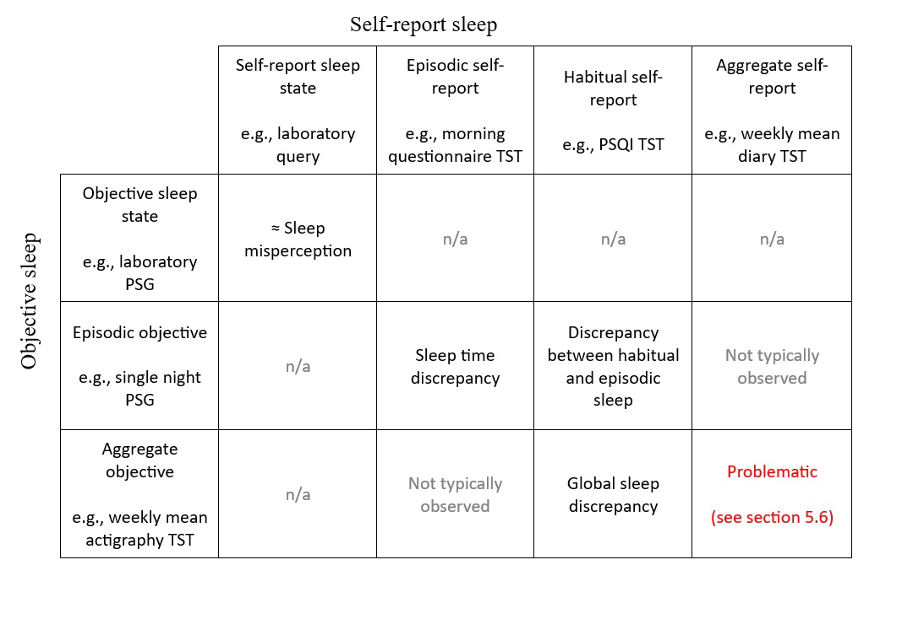

```{r initial code, echo = FALSE, warning = FALSE, message = FALSE}

################################ Initial code ##################################

# packages

library("tidyverse")
library("bookdown")
library("knitr")
library("kableExtra")
library("english")
library("DiagrammeR")   # for PRISMA flowchart
library("networkD3")
library("webshot")
library("scales") # for wrapping the plot text

# Read data set into data frame
full_screen <- read.csv("review_data.csv")

# Trim excluded studies from the data frame
screen <- filter(full_screen, fulltext_include=="Yes" | fulltext_include=="Second study")

#========  Functions to make inline code easier to read (enclose arguments in "")  =========

# catg counts string values equal to second arg in column name (first argument)

catg <- function(x, y, brackets = TRUE) {
  i <- which(colnames(screen) == x)
  
  if (brackets == FALSE) {
    length(which(screen[ ,i] == y))
    }
  else {
  paste0 ("(n = ",
         length(which(screen[ ,i] == y)),
         ")") %>%
         I() # print result "as is"
  }
}

# onehot finds the sum of a column defined by the argument

onehot <- function(x, brackets = TRUE) {
  i <- which(colnames(screen) == x)
  
  if (brackets == FALSE) {
    sum(screen[ ,i], na.rm=TRUE)
  }
  else {
  paste0  ("(n = ",
          sum(screen[ ,i], na.rm=TRUE),
          ")") %>%
          I() # print result "as is"
  }
}

#=================   End of functions   ===================

# Assign some screening variables
duplicates <- 3903 %>% format(nsmall=0, big.mark=",")
total_records <- 6190 %>% format(nsmall=0, big.mark=",")

# Chunk options
knitr::opts_chunk$set(cache = FALSE, fig.pos = "H")

# knitr::knit_hooks$set(plot = function(x, options)  {
#   paste0(knitr::hook_plot_tex(x, options), "\n\\FloatBarrier\n")
# })

#================  ggplot2 theme  =========================

review_theme <- theme(
    legend.position = "none",
    panel.background = element_rect(fill = "transparent", colour = "grey"),
    panel.border = element_rect(fill = NA, colour = "grey"),
    panel.grid = element_line(colour = "lightgrey", linewidth = 0.2, linetype = "solid"),
    strip.placement = "outside",
    axis.title = element_text(size = 8),
    axis.text = element_text(size = 8)
  )

bar_numbers_count <- geom_text(
    aes(label = after_stat(count)),
    stat = "count",
    position=position_dodge(width=0.9),
    hjust=-0.5,
    size=2
  )

bar_numbers_column <- geom_text(
    aes(label = studies),
    position=position_dodge(width=0.9),
    hjust=-0.5,
    size=2
  )

```

<!-- Reviewer #1: The aim of this study is to identify and evaluate the methodology that has been used for conceptualizing sleep discrepancy, and the authors try to focus on the variety of methodology itself rather than clinical significance of sleep misperception and mismeasurement. For this purpose, the authors made the use of various search engines and have shown a thorough list of previous studies. Therefore, this list has a significant value for the researchers who are tackling this theme, but the journal review is not an encyclopedia, and this manuscript is difficult to follow. -->
<!-- Although sleep discrepancy is not limited in the area of insomnia research, the concept of sleep discrepancy originates from sleep state misperception or paradoxical insomnia. I understand the authors' viewpoint described in 5.10 (The scope of sleep discrepancy research is likely to have been underestimated), however, the whole presentation would have been more organized if they restricted the references to those relating to normative/insomnia data. I guess, for the majority of readers, focus of interest is about the methodology used for this population, and it will be the next step to widen this field. -->
<!-- Another aspect which made this manuscript difficult to follow is that the authors mixed the two objective methods to measure sleep, one is PSG, and the other actigraphy. The situation of utilizing these two methods is different, which relates to the purpose of each study, and the authors might have made it more clear by the terms of episodic sleep and habitual sleep. From this aspect, I suggest the authors should divide the result section, one for PSG, and the other for actigraphy. In addition, it may be useful if the authors put a table showing the combination of the plural objective and subjective methods. -->

<!-- Reviewer #2: The authors offer a valuable review focused on sleep discrepancy. The material is well-organized and clearly illustrated and typos are rarely identified, i.e., Sleep discrepancy has been investigated with diverse methods for its conceptualisation and measurement, such that it can be difficult (to?) integrate findings across studies….An individual is unable to directly estimate their (?) number of EEG arousals, quantity or proportion of N3 sleep, or other features of sleep macro or microstructure unavailable to consciousness. -->
<!-- However, authors are warmly invited to clarify their viewpoint on the definition of sleep discrepancy. One sentence states: Sleep discrepancy is a common feature of insomnia disorder, where it is also referred to as sleep misperception or paradoxical insomnia. But a few lines after we find:….paradoxical insomnia, an insomnia subvariant defined, in part, by the presence of sleep discrepancy. -->
<!-- I don't want to criticize the adopted methodological selection, but in my opinion the mismatch between subjective experience and objective measures is not limited to insomnia. We daily interview patients with sleep apnea, periodic myoclonus or RBD who show impressive alterations in conventional sleep measures but not always complain of poor sleep quality or excessive daytime sleepiness. -->
<!-- In an ideal world: -->
<!-- * If you subjectively experience a short sleep duration, your objective TST and SE should be reduced. -->
<!-- * If you subjectively experience several awakenings, your objective WASO should be enhanced. -->
<!-- * If you subjectively experience a superficial sleep, your objective N3 should be attenuated. -->
<!-- * If you subjectively experience a non-restorative sleep, your objective sleep metrics could be apparently normal but are commonly accompanied by increased amounts of EEG arousals and cyclic alternating pattern (CAP). This is what happens in paradoxical insomnia (Parrino et al. 2009). -->
<!-- When this association occurs, we exploit the major potential benefits of both PSG macro- and microstructural information (this means that time is ripe to include CAP metrics in the conventional scoring activity). -->
<!-- Unfortunately, a certain percentage of patients with insomnia, parasomnia, OSA, PLM, still show a mismatch between subjective and objective measurements suggesting that the official classifications of sleep disorders and sleep scoring may undergo impressive and embarrassing leakages. -->
<!-- Perhaps, other biomarkers are neglected (REM sleep fragmentation? autonomic imbalance? mental constraints?) or, more likely, sleep quality resembles a cake that requires balanced amounts of multiple ingredients (milk, butter, flour, sugar, yeast) to become a delicious pie? -->
<!-- Out of metaphor, Efficiency, Continuity, Depth, Stability, Regional EEG processes, Vegetative Burden, Cognitive Modulation are probably distinct ingredients of the sleep quality recipe, which are waiting to be blended in a comprehensive (mathematical) formula aiming to fill the gap between subjective and objective realms. -->
<!-- Maybe we will never reach a 100% overlap, but a review on sleep discrepancy can be an excellent opportunity to face these challenging issues: we hope the authors will not miss the chance. -->

# Abstract {#abstract}

## Study Objectives 

To examine how past studies have conceptualised sleep discrepancy and identify and evaluate the methods used for its measurement and analysis.

## Method

We searched MEDLINE, Embase, PsycINFO, CINAHL Plus, PubMed, Scopus, and Web of Science in April 2022 for studies comparing self-report and objective measures of sleep. Methodological information was extracted from relevant studies and included measures of self-report and objective sleep, sleep variables (e.g., total sleep time), derived discrepancy indices (e.g., difference scores), handling of repeated measurements, and methods of measure comparison (e.g., Bland-Altman analyses).

## Results

`r length(which(full_screen$fulltext_include == "Yes")) %>% english() %>% str_to_sentence` relevant records were identified. Studies varied according to objective sleep measure; actigraphy algorithm, software, and rest interval; polysomnography setting and scoring criteria; sleep variables; self-report sleep measure; number of nights of objective recording; time frame of self-report measure; self-report sleep variable definition; sleep discrepancy derived index; presence and handling of repeated measurements; and statistical method for measure comparison.

## Conclusions

Sleep discrepancy was predominantly conceived as discordance in sleep states or sleep time variables, and various forms of this discordance differed in their conceptual distance to sleep misperception. Furthermore, studies varied considerably in methodology with critical conceptual and practical implications that have received little attention to date. Substantive methodological issues were also identified relating to the use of derived indices for operationalising sleep discrepancy, defining objective sleep onset latency, calculating actigraphy rest intervals, measuring correlation and concordance, averaging sleep variables across nights, and defining sleep quality discrepancy. Solutions and recommendations for these issues are discussed.

## Key words

Sleep discrepancy; sleep misperception; scoping review

## Statement of Significance

Sleep discrepancy, the discordance between self-report and objective measures of sleep, is an important feature for theory in insomnia and a key issue in sleep measurement. Despite the considerable research in this area, the status of sleep discrepancy as a concept is unclear and varied methodologies are employed with unknown theoretical or conceptual implications. This scoping review integrates a comprehensive range of methodological details from sleep discrepancy studies, clarifying the concept of sleep discrepancy and critically evaluating approaches to its measurement. The broad view of the literature afforded by the systematic search allows us to identify and discuss conceptual and methodological issues that have received little attention and are critical for the advancement of research in sleep discrepancy. 

# Introduction {#introduction}

Sleep is measured in two principal ways: objectively through polysomnography or actigraphy, and by self-report through questionnaires or sleep diaries. The discordance that can exist between these two forms of measurement is known as subjective-objective sleep discrepancy, or more simply, sleep discrepancy. Sleep discrepancy is a common feature of insomnia disorder. Individuals with insomnia tend to underestimate total sleep time (TST), and overestimate sleep onset latency (SOL) and wake after sleep onset (WASO) relative to objective measures [@Baglioni2014; @edinger_1995; @means_2003] and are more likely to report prior wakefulness after being woken in laboratory studies [@mendelson_1986; @mercer_2002].

Sleep discrepancy has been investigated with diverse methods for its conceptualisation and measurement, such that it can be difficult to integrate findings across studies. For example, sleep discrepancy may be considered as a spectrum [@trajanovic_2007], ranging from positive (self-report exceeds objective) to negative (objective exceeds self-report), or as a measure of absolute sleep agreement [@baillet_2016]. Any number of sleep variables such as TST, SOL, or WASO can used to operationalise sleep discrepancy, each differing conceptually with a range of theoretical implications. Sleep discrepancy may even be considered beyond these sleep time-based metrics and represent discordance in self-report and objective sleep patterns [@allawati_2021], or sleep quality. Sleep discrepancy can be characterised in a sample by directly comparing self-report and objective sleep with a range of statistical analyses. Other studies may calculated derived variables to define sleep discrepancy quantitatively to measure its relationship with other variables, for example using a difference score of self-report TST -- objective TST.

To date, there have been limited systematic attempts to synthesise or evaluate the varied approaches to investigating sleep discrepancy. Three reviews have been conducted in this area. Castelnovo et al. [-@Castelnovo2019] conducted a systematic review of quantitative definitions of paradoxical insomnia, an insomnia subvariant defined, in part, by the presence of sleep discrepancy. This excluded studies where sleep discrepancy was not used to form diagnostic criteria. Two subsequent reviews were conducted by Rezaie et al. [-@Rezaie2018] and Stephan et al. [-@stephan2023] focussing on paradoxical insomnia and the correlates of sleep misperception, respectively. Whilst informative discussions of research findings, these studies excluded a focus on concepts or methodology.

Consequently, sleep discrepancy remains an ambiguous construct, with conceptual and methodological sources of variation that are yet to be formally delineated. This threatens the development of theory in research areas such as insomnia as it can be unclear whether sleep discrepancy studies are measuring or operationalising the same or different phenomena. The replicability of findings can also be affected where proliferation of varying analysis strategies introduces uncertainty into the data analysis process [@hoffmann2021]. Research is needed to integrate and evaluate the varied approaches to sleep discrepancy, clarify its conceptual boundaries, and facilitate comparisons across studies.

A scoping review is a method of research synthesis that aims to map existing literature in a field of interest and identify types of evidence available in a given topic [@Arksey2005]. We used a scoping review strategy to examine how sleep discrepancy has been conceptualised in the literature and identify and evaluate the methods used to investigate it. A preliminary search of MEDLINE (Ovid), the Cochrane Library, Embase (Ovid), and PsycINFO (Ovid) was conducted to identify existing or in-progress systematic or scoping reviews on the topic. Except for the three reviews mentioned above, no records were identified.

# Methods

## Protocol and registration {#protocol}

The review was conducted according to guidelines provided by the JBI scoping review methodology group [@Peters2020] and reported according to the Preferred Reporting Items for Systematic reviews and Meta-Analyses extension for Scoping Reviews (PRISMA-ScR) Checklist [@tricco2018]. A review protocol was registered with the Open Science Framework on April 4, 2022 (doi: 10.17605/OSF.IO/BCJNQ), prior to conducting searches. Deviations from the protocol are outlined in the appendices (\@ref(deviations)).

## Eligibility criteria {#item6}

Participants of all age groups and clinical populations were included in the review. To adequately map the boundaries of sleep discrepancy as a concept, we included any study that compared an objective measure of sleep (e.g., polysomnography, actigraphy) with an equivalent self-report measure of sleep (e.g., sleep diaries, questionnaires), through statistical analysis or derived indices. Any measure of self-report and objective sleep was considered including indices of sleep time such as TST, SOL, and WASO, in addition to measures of sleep quality, sleep patterns, or any other sleep-related experience or behaviour.

## Exclusion criteria

Studies were excluded that (i) made no direct comparisons between equivalent self-report and objective sleep measures, (ii) included informant, rather than self-report measures, (iii) were case reports or review articles, (iv) were limited to self-report or objective measures not related to sleep, (v) contained no empirical data, (vi) omitted either a self-report or equivalent objective measure of sleep, (vii) were a grey literature source including theses, dissertations, and conference abstracts, or (viii) were not available in English. No records were excluded on the basis of geographic location, cultural factors, or any other contextual feature.

## Search strategy {#item7}

The search strategy aimed to identify articles published in peer-reviewed journals and, initially, grey literature including theses, dissertations, and conference abstracts. Due to the large number of records returned by initial searches, grey literature was excluded at the full text extraction stage. The following databases were searched: MEDLINE (Ovid), Embase (Ovid), PsycINFO (Ovid), CINAHL Plus, PubMed, Scopus, Web of Science, ProQuest Theses and Dissertations, and OSF Preprints. The search strategy included keywords, index terms, and search operators adapted for each database. Searches across all databases were conducted on the 24^th^ April 2022. The full search strategy for Embase (Ovid) is provided as an example in Table \@ref(tab:egsearch) below. See appendices for full search strategies for other databases.

```{r egsearch, echo = FALSE, warning = FALSE, message = FALSE}
col1 <- seq(1:7)
col2 <- c('sleep discrepancy or paradoxical insomnia or subjective insomnia or (sleep adj2 misperception).mp',
          '((self report* or diary or subjective*) and (objective* or actigraph* or polysomnograph* or polygraph*)).mp.',
          '(exp polysomnography/ or exp actimetry/) and exp self report/ ',
          '(sleep* and ("over estimat*" or "over report*" or "under estimat*" or "under report*" or overestimat* or overreport* or underestimat* or underreport* or discrepan* or concordan* or agreement or disagreement or discordan* or congruen* or incongruen*)).mp.',
          '2 or 3',
          '4 and 5',
          '1 or 6'
          )
col3 <- c(488, 193243, 1676, 9362, 193302, 1234, 1569)
df <- data.frame("Step" = col1, "Terms and operators" = col2, "Records" = col3)

kable(df,
      format = "latex",
      booktabs = TRUE,
      col.names = c("Step","Terms and Operators", "Records"),
      caption = "Search strategy for Embase (Ovid)"
      ) %>%
  kable_styling(font_size = 10, full_width = FALSE) %>%
  column_spec(1, width = "1cm") %>%
  column_spec(2, width = "13cm")
```

## Sources of evidence selection {#item9}

Records identified from searches were exported to EndNote 20 [@EndNote20] for collation and then uploaded to Rayyan [@Ouzzani2016] for deduplication and title and abstract screening. Two independent reviewers (TW and SF) screened titles and abstracts to identify studies for full-text retrieval using the inclusion criteria. Percentage of agreement between reviewers was 87.6% and conflicts were resolved via discussion. The full-texts of articles passing title and abstract screening were screened by TW with reasons for exclusion reported. Due to the unanticipated size of the literature, articles from sources other than peer-reviewed journals were added to exclusion criteria after protocol registration.

## Charting the data {#item10}

Data extraction was performed by TW. Methodological features of included articles were selected on their potential influence on the measurement or operational definition of sleep discrepancy and included the following: objective sleep measure type/hardware, actigraphy algorithm, software, and rest interval, polysomnography setting and scoring criteria, self-report sleep measure, sleep variables (e.g., TST, WASO etc...) and definitions thereof, methods of handling repeated measurements, methods of comparing self-report and objective sleep within groups, and methods for operationalising sleep discrepancy to investigate its relationship with other variables.

## Data items {#item11}

Extracted data items numbered in the hundreds and are described comprehensively in the codebook available at: https://github.com/tfwalton/sleep-discrepancy-review/raw/main/data/codebook.xlsx.

## Synthesis of results {#item13}

This manuscript, including all tables and figures summarising data were generated using computationally reproducible methods [@piccolo2016; @lindsay2023] in `r R.version.string` [@r], with R Studio [@rstudio] and R Markdown [@rmarkdown]. Packages used in the code for this manuscript include tidyverse [@tidyverse], bookdown [@bookdown], knitr [@knitr], kableExtra [@kableextra], english [@english], and DiagrammeR [@diagrammer]. All code and data are available through the Github repository: https://github.com/tfwalton/sleep-discrepancy-review.

# Results {#item14}

The initial search of databases returned `r total_records %>% format(nsmall=0, big.mark=",")` from which `r duplicates %>% format(nsmall=0, big.mark=",")` duplicate articles were removed. Details of the review process from article identification, screening, and selection are available in the PRISMA flowchart depicted in Figure \@ref(fig:PRISMA).

```{r PRISMA, echo = FALSE, warning = FALSE, message = FALSE, fig.cap = "PRISMA flowchart", fig.height = 12}
###############################################################################
############################# PRISMA flowchart ################################
#-----------------------------------------------------------------------------#

# Records identified
Embase <- 1569 %>% format(nsmall=0, big.mark=",")
PsycInfo <- 471 %>% format(nsmall=0, big.mark=",")
MEDLINE <- 875 %>% format(nsmall=0, big.mark=",")
Pubmed <- 761 %>% format(nsmall=0, big.mark=",")
CINAHL <- 310 %>% format(nsmall=0, big.mark=",")
SCOPUS <- 826 %>% format(nsmall=0, big.mark=",")
WOS <- 1288 %>% format(nsmall=0, big.mark=",")
Proquest <- 90 %>% format(nsmall=0, big.mark=",")

# Total from all databases 6190

duplicates <- 3894 %>% format(big.mark=",")
screened <- 2296 %>% format(big.mark=",")
excluded <- 1641 %>% format(big.mark=",")
sought <- 655 %>% format(nsmall=0, big.mark=",")
assessed <- 655 %>% format(nsmall=0, big.mark=",")

# No direct comparisons between equivalent parameters
excluded1 <- length(which(full_screen$exclusion_code == 1))        
# Informant report only
excluded2 <- length(which(full_screen$exclusion_code == 2))        
# Duplicate
excluded3 <- length(which(full_screen$exclusion_code == 3))         
# Case report
excluded4 <- length(which(full_screen$exclusion_code == 4))         
# Self-report or objective measures not related to sleep
excluded5 <- length(which(full_screen$exclusion_code == 5))         
# Review article
excluded6 <- length(which(full_screen$exclusion_code == 6))         
# Not empirical study
excluded7 <- length(which(full_screen$exclusion_code == 7))        
# Article in language other than English
excluded8 <- length(which(full_screen$exclusion_code == 8))        
 # Either self-report or objective measure not included
excluded9 <- length(which(full_screen$exclusion_code == 9)) 
# Grey literature source
excluded10 <- length(which(full_screen$exclusion_code == 10))     


ftexcluded <- excluded1 + excluded2 + excluded3 + excluded4 + excluded5 + excluded6 +
  excluded7 + excluded8 + excluded9 + excluded10

final_total <- length(which(full_screen$fulltext_include == "Yes"))

#------------------------------------------------------------------------------#    
###################   Prepare vectors for GraphViz   ###########################
#------------------------------------------------------------------------------#      

titles <- c("Records identified from",
            "Duplicate records removed",
            "Records screened",
            "Records excluded",
            "Reports sought for retrieval",
            "Reports assessed for eligibility",
            "Reports excluded",
            "Total studies included in review"
)

list_identified <- c(paste0("Embase ","(n = ", Embase, ")"),
                     paste0("PsycINFO ","(n = ", PsycInfo, ")"),
                     paste0("MEDLINE ","(n = ", MEDLINE, ")"),
                     paste0("PubMed ","(n = ", Pubmed, ")"),
                     paste0("CINAHL Plus","(n = ", CINAHL, ")"),
                     paste0("SCOPUS ","(n = ", SCOPUS, ")"),
                     paste0("Web of Science ","(n = ", WOS, ")"),
                     paste0("Proquest Theses and Dissertations Global ","(n = ", Proquest, ")")
)

list_duplicates <- c(paste0("(n = ", duplicates, ")"))
list_screened <- c(paste0("(n = ", screened, ")"))
list_excluded <- c(paste0("(n = ", excluded, ")"))
list_sought <- c(paste0("(n = ", sought, ")"))
list_assessed <- c(paste0("(n = ", assessed, ")"))

list_ftexcluded <- c(paste0("(n = ", ftexcluded, ")"),
                     paste0("No direct comparisons between equivalent parameters ","(n = ", excluded1, ")"),
                     paste0("Informant report only ","(n = ", excluded2, ")"),
                     paste0("Duplicate (missed at deplication stage; n = ", excluded3, ")"),
                     paste0("Case report ","(n = ", excluded4, ")"),
                     paste0("Self-report or objective measures not related to sleep ","(n = ", excluded5, ")"),
                     paste0("Review article ","(n = ", excluded6, ")"),
                     paste0("Not empirical study ","(n = ", excluded7, ")"),
                     paste0("Article in language other than English ","(n = ", excluded8, ")"),
                     paste0("Either self-report or objective measure not included ","(n = ", excluded9, ")"),
                     paste0("Grey literature source ","(n = ", excluded10, ")")
)

list_total <- c(paste0("(n = ", final_total, ")"))

#------------------------------------------------------------------------------#    
######################     Generate flow chart     #############################
#------------------------------------------------------------------------------# 

graph <- "
digraph { 


graph[layout = dot, rankdir = TB]
node[shape = box, fontsize = 12, width = 4];

      {rank=same identified duplicates}
      {rank=same screened excluded}
      {rank=same assessed ftexcluded}

        identified [label = '@@1-1\\l     @@2-1\\l     @@2-2\\l     @@2-3\\l     @@2-4\\l     @@2-5\\l     @@2-6\\l     @@2-7\\l     @@2-8\\l']
        duplicates [label = '@@1-2 @@3-1']
        screened [label = '@@1-3 @@4-1']
        excluded [label = '@@1-4 @@5-1']
        sought [label = '@@1-5 @@6-1']
        assessed [label = '@@1-6 @@7-1']
        ftexcluded [label = '@@1-7 @@8-1\\l      @@8-2\\l     @@8-3\\l     @@8-4\\l     @@8-5\\l     @@8-6\\l     @@8-7\\l     @@8-8\\l     @@8-9\\l     @@8-10\\l     @@8-11\\l']
        total [label = '@@1-8 @@9-1']

identified -> duplicates
identified -> screened
screened -> excluded
screened -> sought
sought -> assessed
assessed -> ftexcluded
assessed -> total


}
    [1]: titles
    [2]: list_identified
    [3]: list_duplicates
    [4]: list_screened
    [5]: list_excluded
    [6]: list_sought
    [7]: list_assessed
    [8]: list_ftexcluded
    [9]: list_total
"
grViz(graph, height = "100%")
```

A total of `r nrow(screen)` studies was identified from `r catg("fulltext_include", "Yes", brackets = FALSE) ` records, with `r catg("fulltext_include", "Second study", brackets = FALSE) %>% english()` records reporting two studies or experiments within a single text. Records spanned `r unique(c(screen$country, screen$country2)) %>% length()` countries, with the majority originating from the USA (n = `r length(which(screen$country == "USA" | screen$country2 == "USA"))`). Methodological features of identified studies are described in detail below organised according the research stages study design, measurement and data collection, data preprocessing, variable selection and definition, and statistical analysis. A complete list recorded characteristics are available in Table \@ref(tab:allvariants).

``` {r allvariants, echo = FALSE, warning = FALSE, message = FALSE}

## Table of recorded variants

# Load readxl package
library("readxl")

# Read codebook from folder
codebook <- read_xlsx("codebook.xlsx")

# Keep unique variant descriptions
cb <- unique(codebook[ ,2])

# Remove first 17 variants relating to review process
cb <- cb[-c(1:17),]

# Function to capitalise first letter of each string
capitalise <- function(x) {
  paste0(substring(x,1,1) %>% toupper(), substring(x,2,last = 1000L))
}

# Apply function to cb vector
cb <- sapply(cb, capitalise)

colnames(cb) <- "Description of recorded characteristic"

knitr::kable(cb,
      format = "latex",
      booktabs = TRUE,
      longtable = TRUE,
      caption = "All recorded variants") %>%
  kable_styling(font_size = 8,
                full_width = FALSE,
                latex_options = c("hold_position", "repeat_header"))


```


## Study design {#resultsandsynthesis}

```{r sample sizes, echo = FALSE, warning = FALSE, message = FALSE}
sample_size <- as.numeric(screen$sample_size)
```

Sample sizes for studies ranged from `r min(sample_size, na.rm=TRUE)` to `r max(sample_size, na.rm=TRUE) %>% format(nsmall=0, big.mark=",")` (median = `r median(sample_size, na.rm=TRUE)`, IQR = `r IQR(sample_size, na.rm=TRUE)`). Most studies included both sexes in their samples (n = `r length(which(screen$sample_sex == ""))`), whereas `r  length(which(screen$sample_sex == "men"))` and `r length(which(screen$sample_sex == "women"))` comprised only males or females, respectively. Most studies contained samples of adults of all ages `r catg("sample_age", "adults")`. Others reported specific age groups: older adults (n = `r length(which(screen$sample_age == "older adults"))`), younger adults (n = `r length(which(screen$sample_age == "young adults"))`), adolescents (n = `r length(which(screen$sample_age == "adolescents"))`), and children (n = `r length(which(screen$sample_age == "children"))`). Sample characteristics for studies are included in Figure \@ref(fig:samplechar). For a full list of article characteristics, see the appendices (\@ref(tab:studychar))

```{r samplechar, results = 'asis', collapse = TRUE, echo = FALSE, warning = FALSE, message = FALSE, fig.cap = "Sample characteristics", fig.pos="H", fig.height = 8}

# generate a frequency table for the three columnns
samplechar <- c(screen$sample_clinical, screen$sample_clinical2, screen$sample_clinical3)

# remove the row that counted blank spaces
samplechar <- samplechar[-which(samplechar=="")] %>% as.data.frame()

# assign a name to the single column
colnames(samplechar) <- "sample"

# Generate graph
ggplot(data = samplechar, aes(x = fct_infreq(sample) %>% fct_rev())) +
  geom_bar() +
  scale_fill_grey() +
  labs(x = "Sample characteristics", y = "Number of studies") +
  bar_numbers_count +
  review_theme +
  coord_flip()

```

Other relevant aspects of study design were recorded. `r onehot("misc_cbti", brackets = FALSE) %>% english() %>% str_to_title()` studies investigated sleep discrepancy during, as a predictor of response to, or as an outcome of, cognitive behaviour therapy for insomnia (CBT-I). `r onehot("misc_exp_awakenings", brackets = FALSE) %>% english() %>% str_to_title()` studies used an experimental awakening paradigm where participants were monitored in-lab and woken by sound probes or technician interventions.

## Measurement and data collection

### Measures of objective sleep 

Objective methods of recording sleep formed two major groups: EEG-based methods and movement-based methods. See Figure \@ref(fig:measures) for number of studies using each method. All movement-based methods involved tri-axial accelerometry through actigraphs or similar devices. PSG was the predominant EEG-based method (n = `r sum(screen$obj_PSG, na.rm=TRUE)`), however a handful of studies used EEG alone, in either single channel (n = `r length(which(screen$obj_EEG_other == "single channel EEG"))`), standard (n = `r length(which(screen$obj_EEG_other == "EEG"))`), or high-definition formats (n = `r length(which(screen$obj_EEG_other == "HD-EEG"))`). A single study used a method of sleep recording that involved recording verbal responses from participants elicited by soft tones played at intervals throughout the night [@espie_1989].

``` {r measures, collapse = TRUE, echo = FALSE, warning = FALSE, message = FALSE, fig.cap = "Measures of objective sleep", fig.pos="H", fig.height = 1}

df <- data.frame("objective" = c("EEG (including PSG)", "Movement (including actigraphy)"), "studies" = c(screen$obj_EEG %>% sum(na.rm=TRUE), screen$obj_movement %>% sum(na.rm=TRUE)))

# Generate graph
ggplot(data = df, mapping = aes(x = objective, y = studies)) +
  geom_bar(stat="identity") +
  labs(x = "", y = "Number of studies") +
  review_theme +
  bar_numbers_column +
  scale_y_continuous(limit=c(0,170)) +
  coord_flip()
```

PSG was conducted across a range of settings depicted in Figure \@ref(fig:setting). 

``` {r setting, collapse = TRUE, echo = FALSE, warning = FALSE, message = FALSE, fig.cap = "PSG setting", fig.pos="H", fig.height = 2}

df <- screen$psg_setting %>% as.data.frame()

# remove n/a
df <- df[-which(df$. == "n/a"), ] %>% as.data.frame()

# rename some entries
df[which(df$. == "not reported"), ] <- "PSG setting not reported"
df[which(df$. == "in-lab, home-based"), ] <- "in-lab & home-based"
df[which(df$. == "rest facility"), ] <- "airline rest facility"

# assign a name to the single column
colnames(df) <- "setting"

# capitalise first letter of each row except fMRI
df$setting <- ifelse(df$setting == "fMRI", df$setting, paste0(toupper(substring(df$setting,1,1)), substring(df$setting,2,last = 1000L)))

# re-order factors
df$setting <- factor(df$setting, levels = c("In-lab", "Home-based", "In-lab & home-based", "fMRI", "Airline rest facility", "Truck-berth", "PSG setting not reported"))

# Generate graph
ggplot(data = df, aes(x = setting %>% fct_rev())) +
  geom_bar() +
  scale_fill_grey() +
  labs(x = "Setting", y = "Number of studies") +
  bar_numbers_count +
  review_theme +
  coord_flip()
```

In-lab and home-based tests comprised the substantial majority of PSG settings with a handful of more unusual settings noted. Recording periods for PSG also varied and are depicted in Figure \@ref(fig:period). PSG was most often recorded during the night although a number of alternative periods were observed.

``` {r period, collapse = TRUE, echo = FALSE, warning = FALSE, message = FALSE, fig.cap = "PSG recording period", fig.pos="H", fig.height = 2.25}

df <- screen$psg_period %>% as.data.frame()

# remove n/a
df <- df[-which(df$. == ""), ] %>% as.data.frame()

# rename some entries
df[which(df$. == "nocturnal; MSLT"), ] <- "nocturnal & MSLT"

# assign a name to the single column
colnames(df) <- "period"

# capitalise the first letter of each entry
df$period <- paste0(toupper(substring(df$period,1,1)), substring(df$period,2,last = 1000L))

# re-order factors
df$period <- factor(df$period, levels = c("Nocturnal", "MSLT", "24-hour", "Daytime nap", "Nocturnal nap", "In-flight / layover",  "Nocturnal & MSLT", "Repeated naps across 28-hour period"))

# Generate graph
ggplot(data = df, aes(x = period %>% fct_rev())) +
  geom_bar() +
  scale_fill_grey() +
  labs(x = "Period", y = "Number of studies") +
  bar_numbers_count +
review_theme +
  scale_y_continuous(limit=c(0,110)) +
  coord_flip()


```

*Note.* MSLT refers to the multiple sleep latency test.

Devices used for acquisition of actigraphy data were recorded and are available in a full tabulation of actigraphy characteristics in Table \@ref(tab:bigacti) within the appendices.

### Measures of self-report sleep

Self-report sleep measures comprised seven major types. See Figure \@ref(fig:srmeasure) for the number of studies including each of these.

``` {r srmeasure, echo = FALSE, warning = FALSE, message = FALSE, fig.cap = "Measures of self-report sleep", fig.height = 3.75}

df <- data.frame("measure" = c(
                               "Sleep diary (including the consensus sleep diary)",
                               "Graphical sleep diary",
                               "Questionnaire on awakening",
                               "Graphical response on awakening",
                               "Interview on awakening",
                               "Pittsburgh Sleep Quality Index (PSQI)",
                               "Habitual sleep questionnaire (other than PSQI)"
                               )
                 , 
                 "studies" = c(
                   sum(screen$subj_diary, na.rm=TRUE), 
                   sum(screen$subj_graph, na.rm =TRUE),
                   sum(screen$subj_morningq, na.rm = TRUE) + sum(screen$subj_postnapq, na.rm = TRUE),
                   sum(screen$subj_postnapgraphq, na.rm = TRUE),
                   sum(screen$subj_morninginterview, na.rm=TRUE + sum(screen$subj_expostwakeinterview, na.rm = TRUE)),
                   sum(screen$subj_PSQI, na.rm = TRUE),
                   sum(screen$subj_otherhabitual, na.rm = TRUE)
                   ),
                 "facet" = factor(c("Sleep diary",
                                    "Sleep diary",
                                    "Query on awakening",
                                    "Query on awakening",
                                    "Query on awakening",
                                    "Habitual sleep questionnaire",
                                    "Habitual sleep questionnaire")
                 )
)

df$facet <- df$facet %>% fct_rev()

ggplot(data = df, aes(x = measure, y = studies)) +
  geom_bar(stat = "identity") +
  scale_fill_grey() +
  labs(x = " ", y = "Number of studies") +
  bar_numbers_column +
  review_theme +
  facet_grid(rows = vars(facet),
             scales = "free_y",
             space = "free_y",
             switch = "y",
             labeller = labeller(facet = label_wrap_gen(width = 10))
  ) +
  scale_y_continuous(limit=c(0,120)) +
  coord_flip()

```

Sleep diaries and questionnaires on awakening were the most common measure of self-report sleep, followed by habitual sleep questionnaires including the Pittsburgh Sleep Quality Index [PSQI\; @buysse1989]. Note, habitual sleep refers to questionnaires that require participants to provide global judgements about their sleep that correspond to a period of time longer than a single night such as a week or a month. Graphical response formats for sleep diaries and questionnaires on awakening required participants to draw their sleep on scales comprising discrete blocks of time. Two different approaches to matching self-report to objective sleep were identified. Some studies used self-report measures that attempted to capture habitual sleep, whilst others measured sleep on an episodic basis (e.g., night-by-night or nap-by-nap) that occurred concurrently with objective measurement. Results are depicted in Figure \@ref(fig:habitual) below.

``` {r habitual, collapse = TRUE, echo = FALSE, warning = FALSE, message = FALSE, fig.cap = "Habitual or episodic sleep", fig.height = 1.5}

df <- data.frame("sleep" = c("Habitual sleep", "Episodic sleep", "Habitual and episodic sleep"), "studies" = c(length(which(screen$subj_habitual_desc == "habitual")),
                 length(which(screen$subj_habitual_desc == "matched")),
                 length(which(screen$subj_habitual_desc == "habitual, matched")))
                )
df <- df[rev(rownames(df)),]

# Generate graph
ggplot(data = df, mapping = aes(x = sleep, y = studies)) +
  geom_bar(stat="identity") +
  labs(x = "", y = "Number of studies") +
  review_theme +
  bar_numbers_column +
  scale_y_continuous(limit=c(0,190)) +
  coord_flip()

```

## Data preprocessing

Raw data from objective measures of sleep were processed according to a range of methods. Scoring criteria were recorded for PSG studies and are available in Figure \@ref(fig:scoring).

``` {r scoring, collapse = TRUE, echo = FALSE, warning = FALSE, message = FALSE, fig.cap = "PSG scoring methods", fig.pos="H", fig.height = 1.75}

df <- screen$psg_scoring %>% as.data.frame()

# remove n/a
df <- df[-which(df$. == "n/a"), ] %>% as.data.frame()

# rename some of the entries
df[which(df$. == "SS90-III Sleep Stager System, checked by PSG technologist, coded for 15-min intervals to match diary"), ] <- "SS90-III Sleep Stager System"
df[which(df$. == "not reported"), ] <- "Criteria not reported"

# assign a name to the single column
colnames(df) <- "scoring"

# re-level factors so that "not reported" is last (actually first--will be reversed in the code for the plot)
df$scoring <- factor(df$scoring, levels = c("R&K", "AASM", "Oxford screen scoring method", "R&K and Mendelson", "SS90-III Sleep Stager System", "Criteria not reported"))

# Generate graph
ggplot(data = df, aes(x = scoring %>% fct_rev())) +
  geom_bar() +
  scale_fill_grey() +
  labs(x = "Scoring Criteria", y = "Number of studies") +
  bar_numbers_count +
review_theme +
  coord_flip()
```

Methods for scoring PSG were mostly divided between American Academy of Sleep Medicine (AASM) and Rechtschaffen & Kales (R&K) guidelines. Rogers et al. [-@rogers_reliability_1993] used an automated system for sleep staging, the SS90-III Sleep Stager System (Oxford Medicals, Oxford). Vanable et al. [-@vanable_sleep_2000] used Mendelson's [-@mendelson2012human] guidelines in addition to R&K. Edinger [-@edinger_1995] used combined audio and visual criteria for sleep staging [-@erwin1989]. 

<!-- ============  text reference hack to generate citations for algorithms ===============-->

(ref:boyne) Actiware [@boyne2013]

(ref:motionware) MotionWare (CamNTech, UK)

(ref:sensewear) SenseWear [@lopez2018]

(ref:gorny) Domino Light [@gorny1996]

(ref:cole) Cole-Kripke [@cole1992]

(ref:kripke) Kripke [@kripke1978]

(ref:sadeh) Sadeh [@sadeh1994]

(ref:barreira) Actiheart [@barreira2009]

(ref:hagheyegh) Fitbit [@jean2001]

(ref:ucsd) UCSD [@jean2001]

(ref:actilife) ActiLife [@peach2014]

(ref:actillume) Actillume [@jean2001]

(ref:mems) Micro-Electro-Mechanical-Systems [@dunne2013]

(ref:ssa) Sleep Sign Act (Kissei Comtec Co, Japan)

(ref:im) IM Systems (Individual Monitoring Systems, Inc., UWA)

(ref:john) Machine Learning Alogrithms [@john2019]

(ref:fatiguescience) Fatigue Science [@russell2000]

(ref:barouni) Barouni [@barouni2020]

(ref:choi) Choi [@choi2011]

(ref:tudorlocke) Tudor-Locke [@tudor2014]

(ref:troiano) Troiano [@troiano2008]

<!-- ============                     end of hack                     ===============-->
Actigraphy scoring algorithms are responsible for determining wakefulness and sleep from accelerometer-derived motor activity. Scoring algorithms varied across studies and included (ref:boyne), (ref:motionware), (ref:sensewear), (ref:gorny), (ref:cole), (ref:kripke), (ref:sadeh), (ref:barreira), (ref:hagheyegh), (ref:ucsd), (ref:actilife), (ref:actillume), (ref:mems), (ref:ssa), (ref:im), (ref:john), (ref:fatiguescience), (ref:barouni), (ref:choi), (ref:tudorlocke), and (ref:troiano). The frequencies of these algorithms are depicted in Figure \@ref(fig:algorithms).

```{r algorithms, echo = FALSE, warning = FALSE, message = FALSE, fig.cap = "Actigraphy algorithms", fig.height = 4}

graph <- screen %>% select("acti_algorithm":"acti_algorithm3")

# Function to replace cell values containing Actiware with Actiware

collapseActiware <- function(x) {
  ifelse(grepl("Actiware", x), "Actiware", x)
}

# Apply function to data frame
graph <- apply(graph, c(1,2), collapseActiware)

# Collapse data frame into single vector, generate frequency table, then data frame
graph <- c(graph[,1], graph[,2], graph[,3]) %>% unlist() %>% table() %>% as.data.frame(stringsAsFactors = FALSE)

# Remove the count of blank spaces
graph <- graph[-1, ]

# Replace column names
colnames(graph) <- c("algo", "studies")

# sort ascending by frequency
graph <- graph[order(graph[ ,2], decreasing = FALSE), ]

# rename "not reported"
graph[(graph[ ,1] == "not reported"),1] <- "Algorithm not reported"

# place "not reported" last
graph <- graph %>%
    slice(order(if_else(algo == "Algorithm not reported", 1, 2)))

# Generate graph
ggplot(data = graph, mapping = aes(x = algo, y = studies)) +
  geom_bar(stat="identity") +
  labs(x = "Algorithm", y = "Number of studies") +
  scale_x_discrete(limits=unique(graph$algo)) +  # This keeps the order of the data frame
review_theme +
  bar_numbers_column +
  scale_y_continuous(limit=c(0,60)) +
  coord_flip()

```

Studies using Actiware algorithms varied in their selection of thresholds for scoring wakefulness. These are depicted in Figure \@ref(fig:actiware) below.

```{r actiware, echo = FALSE, warning = FALSE, message = FALSE, fig.cap = "Actiware algorithm threshold settings", fig.height = 2}
acti <- c(screen$acti_algorithm, screen$acti_algorithm2, screen$acti_algorithm3) %>% as.data.frame()

acti <- acti[apply(acti, 1, function(x) grepl("Actiware", x)), ] %>% as.data.frame()

labels = c("All thresholds (Low, Medium, High)", "80 activity counts (High)", "40 activity counts (Medium)", "20 activity counts (Low)", "10 activity counts (Low)", "Actiware wake threshold not reported")

# convert strings to factors
acti[ ,1] <- factor(acti[ ,1], levels = c("Actiware (Low, Medium, High)", "Actiware High (80)", "Actiware Medium (40)", "Actiware Low (20)", "Actiware Low (10)", "Actiware (not reported)"), labels = labels)

colnames(acti) <- "threshold"

ggplot(data = acti, aes(reorder(threshold, -as.integer(threshold)))) +
  geom_bar() +
  scale_fill_grey() +
  labs(x = "Actiware threshold", y = "Number of studies") +
  bar_numbers_count +
  review_theme +
  coord_flip()
```

The rest interval in actigraphy is the period of time where activity is assessed for sleep and is usually intended to coincide with the time the wearer is in bed, attempting to sleep. Information used to define rest intervals varied across reviewed studies and included, singly or in combination, are depicted below in Figure \@ref(fig:intervals).

```{r intervals, echo = FALSE, warning = FALSE, message = FALSE, fig.cap = "Methods for defining rest intervals in actigraphy", fig.height = 3}
#----------------   one-hot encoded rest interval data   ----------------------|

interval <- c("interval_marker",
              "interval_diary",
              "interval_light",
              "interval_activity",
              "interval_external",
              "interval_auto",
              "interval_noreport"
) %>% 
  as.data.frame()
interval["studies"] <- vector()

q = 0

for (x in interval[ ,1]) {
  ref <- which(colnames(screen) == x)
  i <- sum(screen[ref], na.rm = TRUE)
  q <- q + 1
  interval[q ,2] <- i
}

interval[ ,1] <- c("Event marker press",
                   "Sleep diary",
                   "Light sensor",
                   "Manual judgements of activity",
                   "External parameters such as set bed and rise times",
                   "Automatic scoring",
                   "Rest interval not reported")

colnames(interval) <- c("interval", "studies")
#---------------   standard encoding in the "other" column   ------------------|

other <- unique(screen$interval_other)
other <- other[-1] # remove the NA
other <- as.data.frame(other)
other["studies"] <- vector() # add an empty vector

q = 0

for (x in other[ ,1]) {
  i <- length(which(screen$interval_other == x))
  q <- q + 1
  other[q ,2] <- i
}

colnames(other) <- c("interval", "studies")
#------------------------------------------------------------------------------|

interval <- rbind(interval, other)

# sort ascending by frequency
interval <- interval[order(interval[ ,2], decreasing = FALSE), ]

# place "not reported" place last
row_num <- which(interval[ ,1] == "Rest interval not reported")
noreport <- interval[row_num, ]
interval <- interval[-row_num, ]
interval <- rbind(noreport, interval)

# Generate graph
ggplot(data = interval, mapping = aes(x = interval, y = studies)) +
  geom_bar(stat="identity") +
  labs(x = "Rest interval", y = "Number of studies") +
  scale_x_discrete(limits=unique(interval$interval)) +  # This keeps the order of the data frame
  review_theme +
  bar_numbers_column +
  scale_y_continuous(limit=c(0,70)) +
  coord_flip()
```

The precise combination and order of priority of methods in each study varied markedly. See Table \@ref(tab:bigacti) in the appendices for qualitative descriptions of rest interval approaches across reviewed studies. "Discrepancies queried" indicates that discrepant sleep diary and actigraphy bed and wake times were queried directly with participants and adjusted following discussion.

## Variable selection and definition

```{r variables, echo = FALSE}
# Read template table from folder
sleep_variables <- read.csv("sleep_variables.csv")

# Assign 0 to index variable for upcoming loop
q = 0

# Generate empty vector to match length of template table
vec <- vector(length = length(sleep_variables[ ,1]))

# For each variable name listed in the template table...
# search the main dataset for the matching variable
# return the column sum
# store it in the empty vector

for (x in sleep_variables[ ,1]) {
  i <- which(colnames(screen) == x)
  q <- q + 1
  vec[q] <- sum(as.numeric(screen[ ,i]), na.rm = TRUE)
}

# Add new vector to existing template table
sleep_variables <- cbind(sleep_variables, vec)

# Remove the column containing the variable names
sleep_variables<- sleep_variables[ ,-1]

# Rename the columns to something nice
colnames(sleep_variables) <- c("Variable", "Abbreviation", "Calculation", "Equivalent terms", "Studies")

# Add superscript to TWAK for footnote
sleep_variables[which(sleep_variables[ ,2] == "TWAK"),5] <- paste0(sleep_variables[which(sleep_variables[ ,2] == "TWAK"),5], footnote_marker_symbol(1))

# Generate table
# kable(sleep_variables[ ,1:4],
#       caption = "Sleep variables used for operationalising sleep discrepancy",
#       format = "latex",
#       booktabs = TRUE) %>%
#   kable_styling(font_size = 10,
#                 full_width = FALSE,
#                 latex_options = c("hold_position", "scale_down")) %>% footnote(
#     footnote_as_chunk = TRUE, general = "Binary sleep-wake involved measuring at one or multiple instances whether a participant's reported sleep state matched the objective sleep state upon which the query was conditional (e.g., participants were only queried during objectively-confirmed sleep). On the other hand, confusion matrix sleep-wake involved measuring at one or multiple instances whether a participant's reported sleep state matched an objective sleep state that was allowed to vary independent of the query (e.g., participants were queried at a certain time point irrespective of sleep state). The states were called so as the former approach produces a binary outcome whereas the latter produces a confusion matrix.", symbol = "TWAK was not used to define sleep discrepancy directly by any of the included studies but is included in the table for clarity",
#     threeparttable = TRUE
#                                                             )

```

A range of variables were used to operationalise sleep discrepancy. These are listed below in Figure \@ref(fig:vargraph).

```{r vargraph, echo = FALSE, warning = FALSE, message = FALSE, fig.cap = "Sleep variables", fig.height = 6}

# Remove TWAK
df <- sleep_variables[-which(sleep_variables[ ,2] == "TWAK"), ]

# New dataframe from sleep variable table
df <- data.frame(
  "variable" = ifelse(df[ ,2] != "", paste0(df[,1], " (", df[,2], ")"),df[,1]),
  "studies" = as.numeric(df[ ,5])
)

# Rename columns
colnames(df) <- c("variable", "studies")

df <- df[rev(rownames(df)),]

# Generate graph
ggplot(data = df, mapping = aes(x = variable, y = studies)) +
  geom_bar(stat="identity") +
  labs(x = "Sleep variable", y = "Number of studies") +
  scale_x_discrete(limits=unique(df$variable)) +  # This keeps the order of the data frame
  review_theme +
  bar_numbers_column +
  scale_y_continuous(limit=c(0,220)) +
  coord_flip()

```

*Note.* TST was considered equivalent to sleep duration in this review. Calculation of TST and SE varied across studies in both objective and self-report form. SOL (also referred to as sleep latency; SL) varied only in its objective form whilst WASO varied only in its self-report form. TIB was calculated as the time between bedtime (BT) and rise time (RT). BT and polysomnographic lights off time for PSG studies were considered equivalent in this review. RT was considered equivalent to actigraphic sleep offset and polsomnographic lights on. Sleep mid-point was calculated as (FWT--BT)/2. LPS was defined as latency to 10 minutes of uninterrupted sleep. SDSL was defined objective total sleep time following the point of subjective sleep onset. EST was defined as TST--WASO--SOL. SWT was defined as WASO + SOL. TWAK was defined as the length of time between RT and FWT. No definition was reported for IWT. Binary sleep-wake involved measuring at one or multiple instances whether a participant’s reported sleep state matched the objective sleep state upon which the query
was conditional (e.g., participants were only queried during objectively-confirmed sleep). On the other hand, confusion matrix sleep-wake involved measuring at one or multiple
instances whether a participant’s reported sleep state matched an objective sleep state that was allowed to vary independent of the query (e.g., participants were queried at a certain
time point irrespective of sleep state). The states were called so as the former approach produces a binary outcome whereas the latter produces a confusion matrix.

The sleep variables TST, SOL, WASO, and SE were most common and formed the majority of identified parameters. Direct sleep-wake agreement was measured by a small subset of studies. Almost all identified sleep variables were measures related to sleep time or awakenings, although we did note some more unconventional parameters listed below separately from the figure above. Allawati et al. [-@allawati_2021] compared self-report and actigraphic measures of sleep patterns including monophasic, biphasic dawn, biphasic siesta, and polyphasic. Lockley et el [-@lockley_comparison_1999], Dautovich et al. [@dautovich_subjective_2008], Hanisch et al. [@hanisch_sleep_2011], and Nguyen-Michel et al. [@nguyen-michel_underperception_2015] reported discrepancy for naps specifically, including variables such as number of naps, number of days napped, mean duration of naps, and total nap time. Baek et al. [-@baek_2020] and Chan et al. [-@chan_sleep_2018] compared self-report and actigraphic assessments of variability in TST and other sleep parameters. Thun et al. [-@thun_actigraphic_2012] compared self-report and actigraphic measures of morningness-eveningness. Finally, McIntyre et al. [-@mcintyre_2016] investigated self-report-objective discrepancy across a range of sleep behaviours including position at sleep onset, position at wake, number of positional changes, and the presence of leg twitches or jerks. 

### Self-report sleep variable definitions

Calculation of self-report TST, WASO, SE, and TIB varied across studies. Variations across three major types of self-report TST were observed: TST queried directly (e.g., "how many minutes did you sleep last night", TST calculated from other parameters such as TIB, SOL, and WASO, and TST calculated from graphical responses. The results for TST definitions are depicted in Figure \@ref(fig:tstdefinitions) below.

``` {r tstdefinitions, collapse = TRUE, echo = FALSE, warning = FALSE, message = FALSE, fig.cap = "Self-report TST definitions", fig.height = 3}

# concatenate the two TST type columns into a single vector
vec <- c(screen$subj_TST_t, screen$subj_TST_t2)

df <- data.frame("definition" = c("Direct query",
                                  "TIB-SOL-WASO-TWAK",
                                  "TIB-TWT",
                                  "TIB-WASO",
                                  "FA-LO",
                                  "FWT-SOT",
                                  "SPT-SOL-WASO",
                                  "Calculated (calculation not reported)",
                                  "Graphical responses",
                                  "Not reported"),
                 "studies" = c(grepl("question", vec) %>% which() %>% length(),
                               length(which(vec == "TIB-SOL-WASO-TWAK")),
                               length(which(vec == "TIB-TWT")),
                               length(which(vec == "TIB-WASO")),
                               grepl("LO-FA", vec) %>% which() %>% length(),
                               length(which(vec == "FWT-SOT")),
                               length(which(vec == "SPT-SOL-WASO")),
                               length(which(vec == "calculated (not reported)")),
                               length(which(vec == "visual")),
                               length(which(vec == "not reported"))
))

df <- df[rev(rownames(df)),]

# Generate graph
ggplot(data = df, mapping = aes(x = definition, y = studies)) +
  geom_bar(stat="identity") +
  scale_x_discrete(limits=unique(df$definition)) +  # This keeps the order of the data frame
  labs(x = "Variable definitions", y = "Number of studies") +
  review_theme +
  bar_numbers_column +
  scale_y_continuous(limit=c(0,130)) +
  coord_flip()

```

*Note.* FA--LO indicates lights off to final awakening. By conventional definitions of SPT, SPT--SOL--WASO is equal to TIB--SOL--WASO--TWAK, but is listed separately above to reflect differences in terminology.
Definitions for WASO also varied and these are depicted in \@ref(fig:wasodef) below.

``` {r wasodef, collapse = TRUE, echo = FALSE, warning = FALSE, message = FALSE, fig.cap = "Self-report WASO definitions", fig.height = 2}

df <- data.frame("definition" = c("Direct query", "TIB-TST-SOL", "Number of awakenings * average length of awakenings", "Calculated (not reported)", "Graphical responses", "Definition not reported"), "studies" = c(
  grepl("direct question", screen$subj_waso) %>% which() %>% length(),
  length(which(screen$subj_waso == "TIB-TST-SOL")),
  length(which(screen$subj_waso == "number of awakenings multiplied by average length of awakenings")),
  length(which(screen$subj_waso == "calculated (not reported)")),
  length(which(screen$subj_waso == "visual")),
  length(which(screen$subj_waso == "not reported"))
))
  

df[which(df[ ,1] == "TIB-TST-SOL"),1] <- "TIB-TST-SOL"

# Reverse order of df before ggplot reverses it again
df <- df[rev(rownames(df)),]

# Generate graph
ggplot(data = df, mapping = aes(x = definition, y = studies)) +
  geom_bar(stat="identity") +
  scale_x_discrete(limits=unique(df$definition)) +  # This keeps the order of the data frame
  labs(x = "Variable definitions", y = "Number of studies") +
  review_theme +
  bar_numbers_column +
  scale_y_continuous(limit=c(0,50)) +
  coord_flip()

```

Definitions for self-report TIB used in operationalising sleep discrepancy are depicted Figure \@ref(fig:tibdef).

``` {r tibdef, collapse = TRUE, echo = FALSE, warning = FALSE, message = FALSE, fig.cap = "Self-report TIB definitions", fig.height = 2}

df <- data.frame(
  "definition" = c("RT-LO",
                   "FA-LO",
                   "TST + WASO + SOL",
                   "Graphical responses",
                   "Direct query",
                   "Definition not reported"), 
"studies" = c(
  length(which(screen$subj_tib == "LO-RT")),
  length(which(screen$subj_tib == "LO-FA")),
  length(which(screen$subj_tib == "TST+WASO+SOL")),
  length(which(screen$subj_tib == "visual")),
  length(which(screen$subj_tib == "direct question")),
  length(which(screen$subj_tib == "not reported"))
))
  
df <- df[rev(rownames(df)),]

# Generate graph
ggplot(data = df, mapping = aes(x = definition, y = studies)) +
  geom_bar(stat="identity") +
  scale_x_discrete(limits=unique(df$definition)) +  # This keeps the order of the data frame
  labs(x = "Variable definitions", y = "Number of studies") +
  review_theme +
  bar_numbers_column +
  scale_y_continuous(limit=c(0,50)) +
  coord_flip()

```

*Note.* RT--LO refers to the time between lights off and rise time. SE was almost unanimously calculated as TST/TIB\*100 , although varying definitions for the TST and TIB components affect this outcome. One study [@neu_sleep_2007] used two definitions of SE, one comprising TST/TIB and the other TST/sleep period time (SPT).

### Objective sleep variable definitions

Objective TST was defined very consistently with the exception of Sinclair et al. [-@sinclair_2014] who, in addition to providing a standard definition for TST, measured TST across a 24-hour period, such that time spent asleep outside the usual nocturnal period (i.e., naps) contributed to this measurement. Objective definitions for SOL varied considerably and these are depicted in Figure \@ref(fig:SOL) below.\

```{r SOL, echo = FALSE, warning = FALSE, message = FALSE, fig.cap = "SOL definitions", fig.height = 6}
#-------------------------------- SOL Bar Plot --------------------------------|

sol <- c(screen$obj_SOL_t,
                screen$obj_SOL_t2,
                screen$obj_SOL_t3,
                screen$obj_SOL_t4)


df <- table(sol) %>% as.data.frame

colnames(df) <- c("sol", "studies")

# delete row containing NA
df <- df[-which(df$sol==""), ]

# capitalise first letter of each row
df$sol <- paste0(toupper(substring(df$sol,1,1)), substring(df$sol,2,last = 1000L))

# sort ascending by frequency
df <- df[order(df[ ,2], decreasing = FALSE), ]

# rename some columns
df[which(df$sol == "Not reported"), 1]  <- "SOL definition not reported"
df[which(df$sol == "First epoch of any sleep stage"), 1]  <- "First epoch of any sleep stage (standard AASM)"

level_order <- c(
  "Actigraphy-defined",
  "First epoch of any sleep stage (standard AASM)",
  "First 3 consecutive epochs of stage 1 or first epoch of any other sleep (R&K)",
  "First epoch Stage 2",
  "First 20 consecutive epochs any stage of sleep (LPS)",
  "First sleep spindle",
  "First epoch Stage 1",
  "First epoch SWS",
  "First 3 consecutive epochs of sleep",  
  "First 2 consecutive epochs of Stage 2",
  "First 10 consecutive epochs Stage 2",
  "First Stage 2 interrupted by no more than 4 epochs of wake or Stage 1 within 20 epochs",
  "First 20 epochs of sleep containing no more than 4 epochs of wake time, Stage 1 sleep, or movement time",
  "First 20 epochs of Stage 2 or SWS without intervening period of >4 epochs Stage 1 or wakefulness",
  "Video observation",
  "Parameter varied in model",
  "SOL definition not reported"
) %>% rev()

# Generate graph
ggplot(data = df, mapping = aes(x = sol, y = studies)) +
  geom_bar(stat="identity", width = 0.8) +
  labs(x = "SOL definition", y = "Number of studies") +
  review_theme +
  bar_numbers_column +
  scale_y_continuous(limit=c(0,80)) +
  scale_x_discrete(limits=level_order, labels = label_wrap(60)) +
  coord_flip()

```

*Note.* SWS = slow wave sleep, LPS = latency to persistent sleep, AASM = American Academy of Sleep Medicine guidelines, R&K = Rechstaffen & Kales guidelines. Parameter varied in model indicates that the definition of sleep onset was varied within the context of a predictive model. Among PSG studies, the two most common approaches were dependent on standard definitions provided by the R&K [@rechtschaffen1968] and AASM [@berry2012aasm] scoring guidelines.

Most studies used standard PSG or actigraphy criteria for defining objective number of awakenings (i.e., a single epoch of wakefulness). A single exception was Lewis et al. [-@lewis_1969], who stipulated that a period last over a minute to count as an awakening. Neu et al. [-@neu_sleep_2007] used the same definitions for objective SE as they did for self-report SE. 

### Sleep quality

Sleep quality discrepancy was measured by `r onehot("sleep_quality_measured", brackets=FALSE)` studies using (on the self-report side) sleep quality ratings `r catg("subj_sleep_sq_class", "index")`, PSQI total scores `r catg("subj_sleep_sq_class", "PSQI scores")`, sleep quality factor scores `r catg("subj_sleep_sq_class", "factor score")`, sleep depth ratings `r catg("subj_sleep_sq_class", "sleep depth rating")`, or sleep quality composite scores `r catg("subj_sleep_sq_class", "composite score")`. On the objective side, sleep quality measures included SE `r  catg("obj_sq_equiv_class", "SE")`, factor scores from sleep variables `r catg("obj_sq_equiv_class", "factor score")`, sleep architectural variables `r catg("obj_sq_equiv_class", "SE")`, N3 sleep quantity `r catg("obj_sq_equiv_class", "N3 sleep")`, TWT `r catg("obj_sq_equiv_class", "TWT")`, and a composite variable formed from SOL, WASO, and SE `r catg("obj_sq_equiv_class", "composite variable")`. Although approaches varied substantially, the most common combination of sleep quality measures was a sleep quality rating and SE.

## Statistical analysis and operationalising of sleep discrepancy

### Method of handling repeated measurements

Sleep data often involves repeated measurements of the same individual. Actigraphy and sleep diaries usually involve data collection across 7 to 14 days and multiple consecutive nights of PSG are sometimes recorded. Methods for handling repeated measurements are depicted below in Figure \@ref(fig:methodrm)

``` {r methodrm, echo = FALSE, warning = FALSE, message = FALSE, fig.cap = "Methods for handling repeated measurements", fig.height = 4}

df <- data.frame(
  "methods" = c("Means of sleep variables", "Modes of sleep variables", "Medians of sleep variables",  "Means of derived indices", "Standard deviations of derived indices", "Repeated measures ANOVA", "Linear mixed models", "Generalised estimating equations", "Structural equation modelling", "Repeated measures correlation", "Pooled observations", "Separate analyses", "Single recording instance"),
  "studies" = c(
    sum(screen$rm_mvalues, na.rm = TRUE),
    length(which(screen$rm_other == "median values")),
    grepl("modal values", screen$rm_other) %>% which() %>% length(),
    sum(screen$rm_mindices, na.rm = TRUE),
    grepl("standard deviation", screen$rm_other) %>% which() %>% length(),
    sum(screen$rm_rmANOVA, na.rm = TRUE),
    sum(screen$rm_lmm, na.rm = TRUE),
    grepl("generalised estimating", screen$rm_other) %>% which() %>% length(),
    grepl("structural equation", screen$rm_other) %>% which() %>% length(),
    grepl("repeated measures correlation", screen$rm_other) %>% which() %>% length(),
    sum(screen$rm_pool, na.rm = TRUE),
    sum(screen$rm_separate, na.rm = TRUE),
    sum(screen$rm_singlenight, na.rm = TRUE)
    ))
    
df <- df[rev(rownames(df)),]

# Generate graph
ggplot(data = df, mapping = aes(x = methods, y = studies)) +
  geom_bar(stat="identity") +
  labs(x = "Method of handling repeated measurements", y = "Number of studies") +
  scale_x_discrete(limits=unique(df$methods)) +  # This keeps the order of the data frame
  review_theme +
  bar_numbers_column +
  coord_flip()

```

*Note.* pooled observations involved collapsing data across multiple instances of recording. Separate analyses indicate that analyses were conducting separately for each instance of recording. In addition to the above, some studies measuring naturalistic sleep in the home environment took day of week into consideration for analyses. `r (catg("weekend", "weighted average", brackets = FALSE) + catg("weekend2", "weighted average", brackets = FALSE)) %>% english %>% str_to_title()` studies calculated a weighted average for sleep variables equal to $\frac{5}{7}* (mean weekday sleep) + \frac{2}{7}* (mean weekend sleep)$, and `r (catg("weekend", "split", brackets = FALSE) + catg("weekend2", "split", brackets = FALSE)) %>% english()` performed analyses for weeknights and weekends separately.

### Direct comparisons of self-report and objective sleep

A total of `r onehot("aim_agreement", brackets=FALSE)` studies measured sleep discrepancy at the group level by directly comparing self-report and objective sleep. Methods for achieving this varied and are depicted below in Figure \@ref(fig:group)

```{r group, echo = FALSE, warning = FALSE, message = FALSE, fig.cap = "Statistical methods for comparing self-report and objective sleep", fig.height = 4}

group_variables <- read.csv("group_variables.csv")

# Assign 0 to index variable for upcoming loop
q = 0

for (x in group_variables[ ,1]) {
  i <- which(colnames(screen) == x)
  q <- q + 1
  group_variables[q, 3] <- sum(screen[ ,i], na.rm = TRUE)
}

group_variables$variable_name <- factor(group_variables$variable_name, levels = group_variables$variable_name)

# order ascending
group_variables <- group_variables[order(group_variables[ ,3], decreasing = FALSE), ]

# rename not reported and bring to top of data frame
row_num <- which(group_variables[ ,2] == "Other direct comparison (described below)")
other <- group_variables[row_num, ]
group_variables <- group_variables[-row_num, ]
group_variables <- rbind(other, group_variables)

ggplot(data = group_variables, aes(x = variable_name, y = studies)) +
  geom_bar(stat="identity", position="dodge") +
  labs(x = "Methods for direct sleep comparisons", y = "Number of studies") +
  theme(legend.position = "none") +
  scale_fill_grey() +
  scale_y_continuous(limit=c(0,110)) +
  scale_x_discrete(limits=unique(group_variables$variable_name)) +  # This keeps the order of the data frame
  bar_numbers_column +
  review_theme +
  coord_flip()

```

*Note.* Bland Altman analyses include Bland Altman plots and the reporting of 95% limits of agreement [@blandaltman1999]. Pitman's test (also known as the Pitman-Morgan test) is a test of differences of variances between dependent samples [@pitman1939; @morgan1939] and was used to compare the variability of self-report and objective sleep. 
One-sample *t*-tests of difference scores are equivalent to paired *t*-tests but are included separately in the figure to reflect differences in reporting. Classification performance measures include percentage agreement, accuracy, sensitivity, specificity, positive predictive value (PPV), and negative predictive value (NPV). Formulae used for the intra-class correlation coefficient varied across studies. Spearman correlations and Wilcoxon Signed Rank Tests were often used to handle the skew of variables such as SOL and WASO. Other methods included the delta coefficient [@girschik_2012], partial correlation and factor analysis [@regestein_2004], errors-in-variables regression [@lauderdale_2008], repeated measures correlation [@gibson_2023], non-parametric limits of agreement [@thurman_2018], survival agreement [@guedes_2016], latent correlations for testing associations at within-subjects and between-subjects level [@fengsvetnik_2018], and structural equation modelling [@friedmann_2022].

### Methods for investigating the relationship of sleep discrepancy with other variables

A total of `r onehot("aim_construct", brackets=FALSE)` studies aimed to investigate the relationship of sleep discrepancy with other variables of interest. Most studies achieved this by operationalising sleep discrepancy at the individual level through the calculation of a derived index.

#### Derived indices

Approximately half `r onehot("index_present")` of included studies calculated a derived index (e.g., self-report TST--objective TST) to operationalise sleep discrepancy. Some studies used indices directly in statistical analyses `r catg("index_groups", "0")` whilst others used indices to divide samples into groups (n =`r length(which(screen$index_groups == "binary")) + length(which(screen$index_groups == "trichotomy"))`) either dichotomising `r catg("index_groups", "binary")` or trichotomising `r catg("index_groups", "trichotomy")` derived score values. Methods for deriving indices varied across studies and can be broadly categorised into four groups: arithmetic difference scores, where one measure is simply subtracted from the other (e.g., sTST--oTST); absolute difference scores, composed of the absolute value of algebraic difference scores (e.g., \|sTST--oTST\|); ratio scores, when one measure is divided by the other (e.g., sTST/oTST); and combination scores that incorporate both subtraction and division of component measures (e.g., oTST--sTST/oTST). A list of indices including the number of studies that used them are provided in Figure \@ref(fig:derived) below.

```{r derived, echo = FALSE, warning = FALSE, message = FALSE, fig.cap = "Derived indices used for operationalising sleep discrepancy", fig.height = 8}

#------------------------   Derived indices plot   ----------------------------|

codebook <- read.csv("derived_variables.csv")

derived <- c(screen$index1,
             screen$index2,
             screen$index3,
             screen$index4,
             screen$index5,
             screen$index6,
             screen$index7,
             screen$index8) %>% as.factor() 
derived <- derived[-which(derived=="")] %>% as.data.frame()

# ----   Find variable information from variable codes  ----
q = 0 # Assign 0 to index variable for upcoming loop

for (x in derived[ ,1]) {
  i <- codebook[which(codebook[ ,1] == x), 2:4]
  q <- q + 1
  derived[q,2:4] <- i
}

# store order for facets
facet_order <- c("Arithmetic difference scores",
                 "Absolute difference scores",
                 "Ratio scores",
                 "Combination scores",
                 "")

# convert strings to factors (necessary for facet_grid)
derived[ ,2] <- factor(derived[ ,2], levels = facet_order)

ggplot(data = derived, aes(x = reorder(variable_name, variable_name, function(x)length(x)))) +
  geom_bar() +
  scale_fill_grey() +
  labs(x = " ", y = "Number of studies") +
  bar_numbers_count +
  review_theme +
  facet_grid(rows = vars(variable_group),
             scales = "free_y",
             space = "free_y",
             switch = "y",
             labeller = labeller(variable_group = label_wrap_gen(width = 10))
  ) +
  coord_flip()

```

Overall, the sleep variables TST, SOL, and WASO represented the substantial majority of derived indices. Arithmetic difference scores were the most common derived index and with these objective sleep was subtracted from self-report sleep considerably more often than vice-versa. By contrast, ratio scores did not differ in directionality, and all that were recorded featured self-report sleep as the numerator and objective sleep as the denominator. Absolute differences are unique amongst derived indices for operationalising negative sleep discrepancy as equal to positive sleep discrepancy. With the relatively few absolute difference scores noted here it appears that the literature has mostly conceived of sleep discrepancy as a directional concept. All the combination scores identified followed the general format of an arithmetic difference score divided by a component of the difference.

A handful of more atypical derived scores were identified. Jackowska et al. [-@jackowska_psychosocial_2011] created a sleep quality discrepancy index by subtracting a z-transformed self-report sleep quality rating from z-transformed objective SE. Kay et al. [-@kay_variability_2013] derived a nightly variability index for sSOL--oSOL and sWASO--oWASO by dividing intra-individual standard deviations by the sample-wise standard deviation for each variable. Mendelson et al. [-@mendelson_1986] divided self-report sleep following experimental awakenings by objective sleep following experimental awakenings. Winer et al. [-@winer_tau_2021] derived a difference score from subtracting composite scores composed of the average of z scores of TST, SE, and sleep fragmentation (number of awakenings/SPT\*100) from z-transformed PSQI total scores.

#### Other methods for operationalising sleep discrepancy {#altdisc}

A number of other ways to characterise the relationship of sleep discrepancy with other variables of interest were identified and are depicted in Figure \@ref(fig:otherm) below. Some studies operationalised sleep discrepancy using an interaction term within an ANOVA or other linear model such that the other variable(s) of interest was/were instantiated as the moderator of the relationship between self-report and objective sleep. Others used percentage agreement for sleep or other classification performance metrics in subsequent statistical analyses with other variables. Differences between correlations amongst self-report and objective sleep between groups were also tested with bootstrapped confidence intervals [@jackson_2018, @jackson_2020], or the Fisher transformation [@defrancesco_2021]. Some operationalised sleep discrepancy with the Sleep Fragment Perception Index (SFPI), an index that exploits the fact that longer sleep fragments are more likely to be identified as sleep by individuals than shorter fragments [@hermans_modeling_2020]. The SPFI is a parameter modelled to assume the shortest length of objective sleep that is perceived as subjective sleep. For the SFPI, a higher value corresponds to a longer sleep fragment necessary for subjective awareness of sleep and hence greater sleep discrepancy.

``` {r otherm, collapse = TRUE, echo = FALSE, warning = FALSE, message = FALSE, fig.cap = "Other methods for operationalising sleep discrepancy", fig.height = 1.5}

# Create data frame with each one-hot encoded column
df <- data.frame("method" = c("Interaction", "Classification performance in statistical analysis", "Differences between correlations", "Modelled parameter"),
                 "studies" = c(
                   sum(screen$construct_interaction, na.rm=TRUE),
                   sum(screen$construct_agreeinstat, na.rm=TRUE),
                   sum(screen$construct_corrdiff, na.rm=TRUE),
                   sum(screen$construct_modelling, na.rm=TRUE)
                 )
)

# Reverse order of data frame as ggplot will reverse it again
df <- df[rev(rownames(df)),]

# Generate graph
ggplot(data = df, mapping = aes(x = method, y = studies)) +
  geom_bar(stat="identity") +
  scale_x_discrete(limits=unique(df$method)) +  # This keeps the order of the data frame
  labs(x = "Method", y = "Number of studies") +
  review_theme +
  scale_y_continuous(limit=c(0,12)) +
  bar_numbers_column +
  coord_flip()
```

<!-- ========================================================================================================================================== -->
<!-- ===========================================================     DISCUSSION     =========================================================== -->
<!-- ========================================================================================================================================== -->

# Discussion {#item19}

This study reviewed ways of measuring, conceptualising, and analysing sleep discrepancy. Studies varied considerably across the broad range of recorded methodological characteristics and the number of records identified indicated a diverse literature. At the level of measurement and data collection, objective sleep mostly consisted of polysomnography and actigraphy, whilst self-report sleep spanned a range of questionnaires and diaries of varying response formats. Within objective sleep measures, approaches varied according to setting, equipment, and processing of data. Sleep time-related metrics (e.g., TST, SOL, WASO) preponderated in the identified studies, with a small minority measuring direct sleep-wake agreement and a handful of studies measuring other sleep-related features or behaviours. Sleep quality was also investigated by a small number of studies. Definitions for sleep variables themselves did vary across studies although mainly on the self-report side and principally for the variables TST, WASO, and TIB, although objective SOL varied considerably. At the level of data analysis, a range of strategies were employed to accommodate repeated measurements but for many studies, too, there was a single instance of recording. Direct comparisons were commonly made between self-report and objective sleep and these spanned a number of statistical approaches. Many studies went further than comparing self-report and objective sleep directly and attempted to investigate the relationship between sleep discrepancy and other variables. This was achieved most often with derived indices (e.g., self-report TST--objective TST), although other strategies were also used. Our findings are discussed below with recommendations for further research where relevant.

## Methodological heterogeneity poses a problem for sleep discrepancy research

In measuring the discrepancy between two concepts, the discrepancy---or variability---within each concept itself is an important consideration. This is because in any single instance, the discrepancy being measured can be accounted for partially or completely by the variation within each concept. Our results indicate that self-report sleep or objective sleep are not monolithic entities but variegated in ways that may be important. Take, for example, the simplest methodological distinction in objective sleep measurement: polysomnography versus actigraphy. In comparison with PSG, actigraphy generally overestimates sleep and underestimates wake time, and can have trouble distinguishing sleep from quiescent periods of wakefulness [@marino2013]. These trends have been observed to be greater for samples experiencing chronic medical or psychiatric conditions [@conley2019agreement]. Tryon [-@tryon2004] has emphasised that these differences between polysomnography and actigraphy are systematic, rather than random, and that each validly measure different aspects of sleep.

This issue continues through finer methodological distinctions. For example, within actigraphy, estimation of sleep can vary substantially across the various scoring algorithms identified in this review. There is ample evidence indicating that the concordance of actigraphy to PSG by algorithm can vary according to the sample in question [@gao2022actigraphy; @desouza2003;  @quante2018actigraphy; @haghayegh2019] and algorithm performance can even vary based on the actigraph device used [@kripke2010wrist]. A further example can be represented by the sheer range of sleep variables available to operationalise sleep discrepancy. Discrepancy within each variable is likely to have a distinct theoretical meaning. For example, Castelnovo et al. [-@Castelnovo2019] noted that little overlap was found between individuals who misperceive TST and misperceive SOL. Important distinctions continue even within sleep variables themselves. We identified a range of self-report TST definitions, with the most common being direct queries (e.g., "how many hours did you sleep last night?") and calculated parameters (e.g., TST = TIB--SOL--WASO--TWAK). Alameddine et al. [-@alameddine_2015] compared these two definitions and found that calculated estimates tended to exceed those from direct queries. TST discrepancy was overall negative across their sample for those with and without insomnia and so it is possible that indirect queries produce self-report TST that is closer to objective estimates.

For each of these examples, there are differences in sleep discrepancy across methodological approaches that evidence indicates is likely to be systematic. To the extent to which these systematic differences map on to known conceptual differences, distinct kinds of sleep discrepancy must be assumed. If methodological differences do not correspond to distinct concepts, methodological choices are arbitrary and introduce undue uncertainty into inferences [see, @hoffmann2021]. This can be a significant problem. For studies investigating the relationship between sleep discrepancy and another construct, the variance accounted for by the span of possible approaches may well exceed that of the effect for which the researchers are looking. For studies describing sleep discrepancy within a population, findings may not generalise beyond the particular combination of methodological choices that were made in the study.

Addressing this issue may take a number of approaches. A stronger research focus on methods would be helpful overall, with studies such as Alameddine et al. [-@alameddine_2015] having the potential to further demonstrate the effect of deceptively small changes in methodology. A more formal large-scale approach could involve the *multiverse analysis* of @steegen2016, systematically analysing across a variety of data sets resulting from different but justifiable methodological decisions. Specific tools such as structural equation modelling could be used to account for the variance represented by various methodological choices alone or in relation to other constructs [@bagozzi2012]. Theoretical justification or another such rational account should also be provided for selection of sleep variables where possible, as many are likely to be conceptually distinct. A standardised approach to conducting and scoring actigraphy would also be tremendously beneficial, and serve to reduce the considerable methodological variance identified in this particular area.

## Methodological heterogeneity may influence the rate of false-positive findings

Methodological diversity may also have consequences for the rate of false-positives in the sleep discrepancy literature. The term *researcher degrees of freedom* has been used to refer to the range of possible decisions throughout the data collection and analysis process that can be exploited to yield tests that reach statistical significance [@simmons2011]. As evidenced by this review, the amount of researcher degrees of freedom in sleep discrepancy research is considerable, particularly at the data analysis stage, and especially for sleep variable definition and selection. Any combination of the large number of sleep variables identified in this review may be chosen as alternative analytic decisions during analysis. When the different possible definitions of each of these variables are also enumerated, the number of possible decisions seems endless. Note, this issue is not confined to the case of a researcher deliberately exploring analytical alternatives following a null result. In a problem referred to as the *garden of forking paths* [@gelman2013], any methodological decision made in response to an observed feature of the data increases the likelihood that findings will be misleading. An example of this would be selecting SE over TST for a subsequent analysis after observing that SE discrepancy best discriminated individuals with and without insomnia. Even though the eventual result is at this point unknown, the decision of sleep variable is contingent on the data, and ultimately, *p*-values will not reflect what would have happened had TST been chosen instead. For any study investigating the relationship of sleep discrepancy with other constructs, pre-registration of hypotheses and plans for data collection and analysis [@nosek2018] is likely to be helpful in minimising inflated Type I error through post-hoc methodological decisions.

## Definitions of objective sleep onset latency are multifarious and mostly arbitrary {#sol}

Definitions of objective SOL vary considerably in the sleep discrepancy literature. Self-report sleep onset is more likely to coincide with the occurrence of the first sleep spindle, an EEG waveform associated with stage 2 sleep, than with the first incidence of stage 1 sleep [@bonnetmoore_1982]. As such, R&K SOL is likely to have greater correspondence to self-report SOL than AASM SOL. This disparity would be expected to increase with greater sleep fragmentation in the early sleep period and substantial differences in AASM and R&K sleep discrepancy should be expected in samples with disrupted initial sleep. Stricter/longer SOL definitions including the Latency to Persistent Sleep (LPS) [@bianchi_sleep_2012] and complex definitions from Means et al. [-@means_2003] and Lehrer et al. [-@lehrer_2022] are expected to have the closest correspondence to self-report SOL, as research indicates 22-minutes of uninterrupted sleep is needed for healthy adults to perceive a bout of sleep during the beginning of the night [@hermans_sleep_2020]. 

Sleep onset is a continuous process for which it is difficult to identify a clear start-point [@tryon2004]. For example, with PSG scored by AASM criteria, 50% of a 30-second epoch is needed to exhibit sleep for the scoring of a first sleep stage. This means sleep latency is defined as the number of epochs preceding the first uninterrupted \~16 seconds of an EEG depicting activity consistent with sleep. An individual could conceivably achieve this 16-second threshold within two minutes, wake up, and not return for another two hours (SOL = 2 minutes). Equally, an individual could spend a two hour period getting 14-second blocks of sleep before achieving a consolidated bout of sleep (SOL = 120 minutes). These are extreme examples, but they highlight the difficulty with defining a single point of sleep onset. Of course, a line needs to be drawn somewhere, but the position of this line appears to be an arbitrary decision.

Saline et al. [-@saline_sleep_2016] noted another problem although only for studies that investigate both TST and SOL concurrently. In the estimation of TST, individuals may attempt to judge the length of time between their subjective sleep onset and final wake time---anchoring their TST estimate to their SOL estimate. In measuring TST and SOL discrepancy, SOL discrepancy is thus being tested for twice: once in SOL and again implicitly in TST. Their solution to this problem was to obtain independent measurements by estimating the amount of objective sleep measured during the subjective sleep latency period (sleep during subjective latency; SDSL) and the amount of objective sleep measured following the subjective sleep latency period (latency adjusted total sleep time; LA-TST).

In view of these issues, three options are recommended in the context of sleep discrepancy research:

1. Proceed with defining objective SOL using latency to persistent sleep (LPS)---the first 20 consecutive epochs of sleep. Due to the considerable time it takes to perceive a bout of sleep and the rarity and limited magnitude of  SOL underestimation [@saline_sleep_2016; @hermans_sleep_2020] it makes sense to use a longer criterion than a shorter one. LPS also has the advantage of being simpler than many of the alternatives we identified.
2. Use SDSL for the reasons described in the previous paragraph. It should be noted, however, positive discrepancy (i.e., SOL underestimation) is not measurable with this method.
3. Avoid SOL as a sleep variable and to model sleep perception parameters during the sleep onset period according to Hermans et al. [-@hermans_sleep_2020].

Options 2 and 3 have the added advantage of operationalising sleep discrepancy without the use of derived scores---the problems with which are discussed briefly in a following paragraph.

## Sleep discrepancy is mostly restricted to sleep states or sleep time and varies in its conceptual distance to sleep misperception {#misp}

To map the boundaries of the concept of sleep discrepancy, we included any studies comparing objective sleep with an equivalent measure of self-report sleep. From the very few studies identified investigating sleep patterns or other sleep-related behaviours it appears that sleep discrepancy is mostly restricted to discordance in sleep states (e.g., wakefulness versus sleep) or discordance in sleep time parameters (e.g., total sleep time). It may be helpful to consider sleep discrepancy, as so defined, in relationship to sleep misperception. These two terms have been used interchangeably in the past and the problems with doing this have been noted by a number of authors [@Moul2004; @tryon2004]. Stated simply, sleep is a complex process for which there no one perfectly valid measure, and using the term *sleep misperception* brings a status to objective measures of sleep that may not be warranted. For example, sleep-like EEG activity can occur during waking consciousness in a phenomenon known as local sleep [@krueger2019local], and other dissociations between the EEG and sleep-related physiological processes have been observed under some conditions [@krueger2013sleep]. Moreover, conventional sleep scoring is but one way of classifying EEG data and subtler systems exist, including the cyclic alternating pattern [@Parrino2012].

Whilst it may not be possible to directly measure sleep misperception for these reasons, sleep discrepancy can be closer or further from sleep misperception conceptually depending on its operational definition. Closest are studies measuring sleep-wake agreement or classification using EEG under laboratory conditions. In a case where a participant who, being asleep for five minutes, is woken by a technician and reports complete wakefulness for the preceding period, only the fallibility of objective recording can account for a conceptual distinction between sleep discrepancy and true sleep-state misperception. This fundamental sleep discrepancy represented by direct sleep-wake agreement can be contrasted with sleep discrepancy represented by sleep time variables (e.g., TST, SOL). Moving from sleep-wake agreement to sleep time variables introduces additional factors that may account for the incongruence between self-report and objective sleep and hence provides a broader definition of sleep discrepancy. On the objective side, PSG potentially introduces artefact from transient (e.g., \<15 second) awakenings [@smith2000] and the arbitrary nature of SOL definitions (see section \@ref(sol)). Actigraphy introduces the potential for immobile wake to be scored as sleep [@desouza2003; @paquet2007] and variance contributed by methodological factors such as choices in scoring algorithms. On the self-report side, sleep diaries and questionnaires introduce memory or reporting biases [@clegg2023real] as potential factors contributing to sleep discrepancy. See Harvey et al. [-@Harvey2012] for a discussion of these factors in the context of insomnia.

In the present review, we reported a key distinction between *habitual* and *episodic* measures of self-report sleep. Moving from episodic to habitual measures broadens the concept of sleep discrepancy yet further. A more global sleep discrepancy may be represented by comparisons of habitual self-report sleep with aggregated objective sleep (e.g., mean sleep variables values across 14 nights of actigraphy), the underlying processes for which are likely different to those of individual nights. Where habitual self-report sleep is compared to objective estimates spanning one to a few nights, intra-individual variation in sleep patterns is introduced to sleep discrepancy. In other words, some component of the difference between objective and self-report sleep can be accounted for by the difference between habitual sleep and the circumstances of testing---which may be substantial. If the objective measure is PSG, effects of the laboratory/testing environment [i.e., the first night effect @Agnew1966; @newell2012one] are additionally introduced. These forms of sleep discrepancy are illustrated in the matrix provided in Figure \@ref(fig:subtypes).

``` {r subtypes, echo=FALSE, fig.cap = "Sleep discrepancy matrix"}



```

*Note.* Conceptual proximity of sleep discrepancy to true sleep state misperception decreases moving down and across the figure. Problems using aggregate measures of both self-report and objective sleep are described in more detail in section \@ref(averaging)

## Derived indices are common and the use of these as an operational measure of sleep discrepancy is problematic {#dvar}

Derived variables, including difference scores and ratio scores, are overwhelmingly the most common way of operationalising sleep discrepancy to investigate its relationship with other variables. The use of derived variables for such a purpose is associated with a range of conceptual and methodological problems [@Cronbach1970; @edwards2002; @Kronmal1993] that are severe enough to warrant discontinuing their use in sleep discrepancy research. Stated briefly, in a relationship with another variable, the effect of each component of a derived index (e.g., a difference score representing the subtraction of self-report from objective TST) is confounded such that it is not possible to determine whether self-report sleep, objective sleep, or some combination of the two is driving the relationship [@edwards2002]. Moreover, derived scores impose inappropriate constraints on relationships between other variables that are often not entailed by, or else contradictory to, stated hypotheses [@edwards2002]. A large range of derived variables were identified by this review, none of which escape the problems described by the aforementioned authors. Fortunately, a number of alternative strategies for characterising relationships between sleep discrepancy and other constructs are available. Such methods identified in this review included using classification performance metrics within conventional statistical analyses, representing sleep discrepancy with moderation/interaction effects, and modelling sleep discrepancy parameters mathematically.

## Averaging sleep variables across multiple nights is a common practice and can cause problems {#averaging}

In the studies identified in this review, the most common way of handling repeated measurements of sleep variables was by averaging across multiple instances of recording. This technique is problematic when applied to concurrent episodic (i.e., nightly) measurements of self-report and objective sleep as it relies on the assumption that patterns of sleep over/underestimation are consistent across nights. Extreme positive and negative sleep discrepancy occurring alternately on successive nights could result in averages denoting negligible discrepancy. This may be a realistic concern for research in sleep discrepancy and insomnia, for example. Although most individuals with insomnia tend to underestimate sleep, high inter-night variability is observed [@herbert_2017] and some individuals will overestimate sleep [@trajanovic_2007; @telindert_2020]. An exception to this problem exists in the case of comparing aggregated objective sleep against a habitual measure of self-report sleep, such as the PSQI. Here, using means or medians to determine habitual measures of objective sleep is necessary to define sleep discrepancy at the habitual, rather than the episodic level. In other cases, linear mixed models, generalised estimating equations, and structural equation models were methods identified in this review that can avoid problems with averaging across repeated measures.

## Correlations have sometimes been used inappropriately as a measure of concordance

Despite being the most common approach to comparing self-report and objective sleep measures, Pearson or Spearman correlations are broadly inappropriate for the characterisation of agreement or discrepancy. Correlation is strictly a measure of association between two variables and is insensitive to systematic error between measures [@liu2016]. For example, the same correlation coefficient may equally describe a sample where self-report and objective estimates of sleep tend to be equal as one where (i), objective estimates tend to exceed self-report estimates by a given constant (e.g., two hours) or (ii), the value of objective sleep varies proportional to the level of self-report sleep. Measures of agreement including Bland-Altman analyses, intra-class correlation, and Lin's concordance coefficient were also used by a large number of studies and are preferable for the measurement of discrepancy in equivalent parameters.

## Sleep quality discrepancy is conceptually unclear

Sleep quality discrepancy was measured by a small number of studies in this review, according to varying approaches. The predominant strategy of comparing objective sleep efficiency to self-report sleep quality ratings is supported by research indicating that the former shares considerably more variance with the latter than any other conventional objective metric [@kaplan2017]. Nevertheless, sleep quality discrepancy remains a difficult topic for two reasons. First, there is no consensus approach to operationalising sleep quality. A recent review of methods for measuring sleep quality identified an immense range in strategies, especially for objective measures [@mendoncca2019review]. Second, there are no clear self-report analogues for objective measures of sleep quality, or vice-versa. For any episode of sleep, an individual is unable to directly estimate number of EEG arousals, quantity or proportion of N3 sleep, or other features of sleep macro or microstructure unavailable to consciousness. Equally, it is not clear how to compare a sleep quality rating judgement (e.g., on a Likert scale) with objective measures [see @krystaledinger2008]. Although comparing subjective sleep experiences to non-equivalent objective measures is likely profitable for understanding insomnia and sleep misperception [e.g., @stephan2021; @kaplan2017], the practice lies conceptually outside of sleep discrepancy, as defined by the inclusion criteria of the present review. The sleep quality discrepancy studies identified by the present review were included as recognised attempts to explicitly operationalise self-report and objective sleep quality yet there are likely many other studies with comparable measures that did not employ such language. For example, @lichstein2017 has used the term *uncoupled sleep* to refer to situations where sleep complaint (which can be regarded as a binary self-report measure of sleep quality), does not correspond with objective findings of good or poor sleep. Whether the term sleep discrepancy be expanded to encompass these cases remains an open question. At present, more research is needed before it becomes clear what it means for non-equivalent self-report and objective measurements of sleep quality not to cohere.

<!-- As stated by @krystal2008quality "it seems unlikely that such a global rating would be consistently related to a single physiological aspect of sleep".

As such, sleep quality discrepancy is not as clear conceptually as, for example, sleep time discrepancy as introduced in a previous paragraph, and investigating the relationships of sleep quality discrepancy to other variables is unlikely to be profitable until the conceptual status of self-report and objective sleep quality is clearer.

<!-- Generally, self-report and objective measures of sleep quality do not cohere well @kaplan2017 -->
  -->
<!-- Sleep efficiency (SE), the most common objective sleep quality component identified in this review, is unlikely to -->
<!-- Studies by @harvey2008subjective and @libman2016 found that self-report sleep quality in both healthy adults and those experiencing insomnia was typically defined by feelings and mood upon waking, consolidation and continuity of sleep, and daytime functioning.  -->
<!-- Sleep continuity discrepancy could be a good candidate -->
<!-- comparing holistic measures of sleep quality e.g., PSQI not appropriate to compare with nightly objective sleep -->
<!-- Sleep questionnaires such as the PSQI that provide a more global measure of sleep quality -->

## Sleep diaries should not be used to define rest intervals in sleep discrepancy research {#actidiary}

Sleep diaries were the most commonly identified method of rest interval definition in this review. Sleep diaries were classified by this review as a self-report measure of sleep. By using sleep diaries to define actigraphic rest intervals, self-report sleep is being used to partially define an objective sleep measure. In this case, the measured discrepancy between the two forms of sleep measurement will not be an accurate representation of their actual incongruence. The high frequency at which sleep diaries are back-filled or misreported [@clegg2023real] highlights the significance of this issue. We noted that a single study in the present review addressed this problem directly. Krahn et al. [-@krahn_assessing_1997] ensured that manual scorers of the rest intervals for their actigraphy data were blinded to the sleep diary. It may be helpful for further research that alternatives such as these are sought for defining rest interval periods.

## The scope of sleep discrepancy research is likely to have been underestimated

The scope of the literature on sleep discrepancy has been considerably underestimated to date. We intended to identify a broad range of studies in this review that may have captured the concept of sleep discrepancy without necessarily referring to this or related terms. A search across full texts of all studies included in this review returned `r (grepl("discrepancy", screen$abstract, ignore.case = TRUE) & grepl("sleep", screen$abstract, ignore.case = TRUE)) %>% sum()` records making explicit mention of "sleep" and "discrepancy", leaving `r nrow(screen) - (grepl("discrepancy", screen$abstract, ignore.case = TRUE) & grepl("sleep", screen$abstract, ignore.case = TRUE)) %>% sum()` that would have otherwise been unidentifiable through simple keyword searching of this concept. It is likely that existing sleep discrepancy research across domains may be excessively siloed into respective research areas. Looking at the clinical populations encompassed in this review, there appear to be small but distinguishable sleep discrepancy research programmes in post-traumatic stress disorder, bipolar disorder, pregnancy, traumatic brain injury, and fibromyalgia, to name just a few. Whilst sleep discrepancy is best understood in the context of insomnia, it is possible similar processes underlie the presence of sleep discrepancy in these groups. For example, the role of sleep disturbance as a transdiagnostic factor across psychiatric disorders has been emphasised [@harvey2011sleep] and a mechanistic role for sleep misperception has been suggested for disorders outside of insomnia [@richardson2016].

<!-- ## Implications for clinical practice -->

<!-- This review has some implications for clinical practice beyond that of highlighting sleep discrepancy research outside of insomnia. Firstly,   -->

<!-- <!-- As a review focussed on concepts and methodology in sleep discrepancy, implications for clinical practice can only be interpreted indirectly. -->

<!-- <!-- Sleep misperception best measured by studies with experimental procedures. -->
<!-- <!-- There are an abundance of methodological problems associated with sleep-time discrepancy studies -->
<!-- <!-- Studies measuring global sleep discrepancy of habitual self-report and aggregate objective measures -->

## Strengths and limitations {#item20}

This study represents the largest systematic approach to investigating methodology in the area of sleep discrepancy research. We reported a broad range of methodological features across a large number of studies and provided meaningful syntheses of research methods in a diverse field. Two major changes were made to our own methods during the screening process and following registration of the scoping review protocol that may be viewed as limitations. These changes were both made in response to the unanticipated number of records returned following title and abstract screening and in view of limited resources available for charting and synthesis. First, grey literature was removed from inclusion criteria. Although the issues and recommendations discussed in this paper were limited to published research, our findings remain broadly applicable and no syntheses of empirical findings have been made that could be influenced by publication bias. Second, reference lists were not screened for additional studies and the extent to which this review may be considered an exhaustive representation of the literature may be reduced as a result.

## Practice points

1. Sleep discrepancy has been investigated throughout a broad range of clinical populations outside of insomnia
2. Many sleep discrepancy studies involve at least one significant methodological problem that may threaten the validity of findings
3. Available alternatives to operationalising SOL should be employed over traditional approaches
4. Rest intervals should be defined without the use of sleep diaries if actigraphy is to be used to measure sleep discrepancy

## Research Agenda

1. Further research is necessary to determine where methodological differences in sleep discrepancy approaches indicate meaningful conceptual differences
2. The impact of varying justified approaches to measuring and operationalising sleep discrepancy should be assessed
3. Integrated and standardised approaches to conducting actigraphy would benefit sleep discrepancy research by reducing methodological heterogeneity
4. Open science practices including pre-registration and research transparency have the potential to improve sleep discrepancy research

## Summary {#item21}

Methods for investigating sleep discrepancy have varied considerably in the literature across the areas of study design, data collection and measurement, data preprocessing, and data analysis. Many of these varied approaches have substantial effects on what sleep discrepancy means as a concept and sometimes are associated with methodological problems that may not be immediately clear. Sleep discrepancy research holds promise for advancing understanding of sleep, its disorders such as insomnia, and mechanisms at play in psychiatric and other disorders. Clear concepts and appropriate methodology is essential to ensure that work in this area remains a progressive science. Measuring discrepancy or congruence is often a deceptively complex undertaking and we hope that this scoping review will prove helpful and informative to those interested in designing or interpreting sleep discrepancy studies.

# Data availability statement

All code and data underlying this article are available from github: https://github.com/tfwalton/sleep-discrepancy-review.

# Acknowledgements

We would like to thank the librarians at the University of Western Australia library for their assistance with the development of the search strategy.

# Financial disclosure statement

None.

# Funding {#item22}

This work forms part of PhD project funded by the Australian Government Research Training Program.

# Declaration of competing interest

The authors declared that they had no conflicts of interest with respect to their authorship or the publication of this article.

\newpage

# Appendices

## Search strategies

Search strategies for databases searched using the Ovid system are available in Table \@ref(tab:ovid).

``` {r ovid, echo = FALSE, warning = FALSE, message = FALSE}
col1 <- c(seq(1:7), seq(1:7), seq(1:7))
col2 <- c('sleep discrepancy or paradoxical insomnia or subjective insomnia or (sleep adj2 misperception).mp',
          '((self report* or diary or subjective*) and (objective* or actigraph* or polysomnograph* or polygraph*)).mp.',
          '(exp polysomnography/ or exp actimetry/) and exp self report/ ',
          '(sleep* and ("over estimat*" or "over report*" or "under estimat*" or "under report*" or overestimat* or overreport* or underestimat* or underreport* or discrepan* or concordan* or agreement or disagreement or discordan* or congruen* or incongruen*)).mp.',
          '2 or 3',
          '4 and 5',
          '1 or 6',
          'sleep discrepancy or paradoxical insomnia or subjective insomnia or (sleep adj2 misperception).mp',
          '((self report* or diary or subjective*) and (objective* or actigraph* or polysomnograph* or polygraph*)).mp.',
          '(exp polysomnography/ or exp actigraphy/) and exp self report/ ',
          '(sleep* and ("over estimat*" or "over report*" or "under estimat*" or "under report*" or overestimat* or overreport* or underestimat* or underreport* or discrepan* or concordan* or agreement or disagreement or discordan* or congruen* or incongruen*)).mp.',
          '2 or 3',
          '4 and 5',
          '1 or 6',
          'sleep discrepancy or paradoxical insomnia or subjective insomnia or (sleep adj2 misperception).mp',
          '((self report* or diary or subjective*) and (objective* or actigraph* or polysomnograph* or polygraph*)).mp.',
          '(exp polysomnography/ or exp actigraphy/) and exp self report/ ',
          '(sleep* and ("over estimat*" or "over report*" or "under estimat*" or "under report*" or overestimat* or overreport* or underestimat* or underreport* or discrepan* or concordan* or agreement or disagreement or discordan* or congruen* or incongruen*)).mp.',
          '2 or 3',
          '4 and 5',
          '1 or 6'
)
col3 <- c(488, 193243, 1676, 9362, 193302, 1234, 1569, 175, 57592, 59, 2112, 57592, 346, 471, 260, 139088, 561, 5280, 139088, 692, 875)
df <- data.frame("step" = col1, "terms" = col2, "records" = col3)
colnames(df) <- c("Step", "Terms and operators", "Records")

kable(df,
      format = "latex",
      booktabs = TRUE,
      caption = "Search strategy for Ovid databases"
) %>%
  kable_styling(font_size = 8,
                latex_options = "hold_position") %>%
  pack_rows("Embase", 1,7) %>%
  pack_rows("PsycINFO", 8,14) %>%
  pack_rows("Medline", 15,21) %>%
  column_spec(1, width = "5em") %>%
  column_spec(2, width = "40em") %>%
  column_spec(3, width = "6em")

```

\newpage

Search strategies for other databases are listed in Table \@ref(tab:databases).

``` {r databases, echo = FALSE, warning = FALSE, message = FALSE}

col1 <- c(
'("sleep discrepancy" OR "paradoxical insomnia" OR "subjective insomnia") OR (sleep AND misperception) OR
(("self report*" or diary or subjective*) AND (objective* or actigraph* or polysomnograph* or polygraph*)) OR (("Polysomnography/methods"[MAJR] OR "Actigraphy/methods"[MAJR]) AND "Self Report"[MeSH])
AND (sleep* AND ("over estimat*" OR "over report*" OR "under estimat*" OR "under report*" OR overestimat* OR overreport* OR underestimat* OR underreport* OR discrepan* OR concordan* OR agreement OR disagreement OR discordan* OR congruen* OR incongruen*))',

'("sleep discrepancy" OR "paradoxical insomnia" OR "subjective insomnia") OR (sleep AND misperception) OR
(("self report*" or diary or subjective*) AND (objective* or actigraph* or polysomnograph* or polygraph*))
AND (sleep* AND ("over estimat*" OR "over report*" OR "under estimat*" OR "under report*" OR overestimat* OR overreport* OR underestimat* OR underreport* OR discrepan* OR concordan* OR agreement OR disagreement OR discordan* OR congruen* OR incongruen*))',

'TITLE-ABS-KEY ( ( "sleep discrepancy"  OR  "paradoxical insomnia"  OR  "subjective insomnia" )  OR  ( sleep  AND  misperception )  OR  ( ( "self report*"  OR  diary  OR  subjective* )  AND  ( objective*  OR  actigraph*  OR  polysomnograph*  OR  polygraph* ) )  AND  ( sleep*  AND  ( "over estimat*"  OR  "over report*"  OR  "under estimat*"  OR  "under report*"  OR  overestimat*  OR  overreport*  OR  underestimat*  OR  underreport*  OR  discrepan*  OR  concordan*  OR  agreement  OR  disagreement  OR  discordan*  OR  congruen*  OR  incongruen* ) ) ) ',

'("sleep discrepancy" OR "paradoxical insomnia" OR "subjective insomnia") OR (sleep AND misperception) OR
(("self report*" or diary or subjective*) AND (objective* or actigraph* or polysomnograph* or polygraph*))
AND (sleep* AND ("over estimat*" OR "over report*" OR "under estimat*" OR "under report*" OR overestimat* OR overreport* OR underestimat* OR underreport* OR discrepan* OR concordan* OR agreement OR disagreement OR discordan* OR congruen* OR incongruen*))',

'noft(("sleep discrepancy" OR "paradoxical insomnia" OR "subjective insomnia") OR (sleep AND misperception) OR
((("self report*" or diary or subjective*) AND (objective* or actigraph* or polysomnograph* or polygraph*))
AND (sleep* AND ("over estimat*" OR "over report*" OR "under estimat*" OR "under report*" OR overestimat* OR overreport* OR underestimat* OR underreport*
OR discrepan* OR concordan* OR agreement OR disagreement OR discordan* OR congruen* OR incongruen*))))'
)

col2 <- c(761, 310, 826, 1288, 90)
col3 <- c("Pubmed", "CINAHL", "Scopus", "Web of Science", "Proquest Theses and Dissertations Global")
df <- data.frame("database" = col3, "terms" = col1, "records" = col2)
colnames(df) <- c("Database", "Terms and operators", "Records")

kable(df,
      format = "latex",
      booktabs = TRUE,
      caption = "Search strategy for other databases"
      ) %>%
  kable_styling(font_size = 8,
                latex_options = "hold_position") %>%
  column_spec(1, width = "7em") %>%
  column_spec(2, width = "40em") %>%
  column_spec(3, width = "4em")

```

\newpage

## List of deviations from protocol {#deviations}

The following are a list of deviations from the scoping review protocol registered on the Open Science Framework (doi: 10.17605/OSF.IO/BCJNQ).

1. The term actimetry in Medline and PSYCinfo searches was changed to actigraphy
2. The scoping review protocol listed an incorrect number of duplicates records following searches
3. All records that were not peer reviewed journal articles were excluded at the full-text screening stage in the final review
4. Other items were added to the exclusion criteria at the full-text screening stage including:
 + study measured informant-report rather than strictly self-report sleep
 + study did not include statistical comparison of self-report and objective sleep (e.g., numerical comparisons only, single-case design)
5. Reference lists were not searched for additional citations as planned in the protocol

\newpage

## PRISMA-ScR checklist

A PRISMA-ScR checklist is available in Table \@ref(tab:checklist).

``` {r checklist, echo = FALSE, warning = FALSE, message = FALSE}

col1 <- c(
  "Title", "Structured summary", "Rationale", "Objectives", "Protocol and registrations", "Eligibility criteria", "Information sources", "Search", "Selection of sources of evidence", "Data charting process", "Data items", "Critical appraisal of individual sources of evidence", "Synthesis of results", "Selection of sources of evidence", "Characteristics of sources of evidence", "Critical appraisal within sources of evidence", "Results of individual sources of evidence", "Synthesis of results", "Summary of evidence", "Limitations", "Conclusions", "Funding"
)

col2 <- seq(1:22)

col3 <- c(
  "Identify the report as a scoping review.",
  "Provide a structure summary that includes (as applicable): background, objectives, eligibility criteria, sources of evidence, charting methods, results, and conclusions that relate to the review questions and objectives.",
  "Describe the rationale for the review in the context of what is already known. Explain why the review questions/ objectives lend themselves to a scoping review approach",
  "Provide an explicit statement of the questions and objectives being addressed with reference to their key elements (e.g., population or participants, concepts, and context) or other relevant key elements used to conceptualise the review questions and/or objectives.",
  "Indicate whether a review protocol exists; state if and where it can be accessed (e.g., a Web address); and if available, provide registration information, including the registration number.",
  "Specify characteristics of the sources of evidence used as eligibility criteria (e.g., years considered, language, and publication status), and provide a rationale.",
  "Describe all information sources in the search (e.g., databases with dates of coverage and contact with authors to identify additional sources), as well as the date the most recent search was executed.",
  "Present the full electronic search strategy for at least 1 database, including any limits used, such that it could be repeated.",
"State the process for selecting sources of evidence (i.e., screening and eligibility) included in the scoping review.",
"Describe the methods of charting data from the included sources of evidence (e.g., calibrated forms or forms that have been tested by the team before their use, and whether data charting was done independently or in duplicate) and any processes for obtaining and confirming data from investigators.",
"List and define all variables for which data were sought and any assumptions and simplifications made",
"If done, provide a rationale for conducting a critical appraisal of included sources of evidence; describe the methods used and how this information was used in any data synthesis (if appropriate).",
"Describe the methods of handling and summarizing the data that were charted",
"Give numbers of sources of evidence screen, assessed for eligibility, and included in the review, with reasons for exclusions at each stage, ideally using a flow diagram.",
"For each source of evidence, present characteristics for which data were charted and provide the citations.",
"If done, present data on critical appraisal of included sources of evidence (see item 12).",
"For each included source of evidence, present the relevant data that were charted that relate to the review questions and objectives.",
"Summarize and/or present the charting results as they relate to the review questions and objectives.",
"Summarize the main results (including an overview of concepts, themes, and types of evidence available), link to the review questions and objectives, and consider the relevance to key groups",
"Discuss the limitations of the scoping review process.",
"Provide a general interpretation of the results with respect to the review questions and objectives, as well as potential implications and/or next steps.",
"Describe sources of funding for the included sources of evidence, as well as sources of funding for the scoping review. Describe the role of the funders of the scoping review."
)

# Double backslash so rmarkdown doesn't read it as an escape

col4 <- c("1", #item1
          "1", #item2
          "2", #item3
          "2", #item4
          "3.1", #item5
          "3.2",
          "3.4",
          "3.1", #item8
          "3.5",
          "3.6",
          "3.7",
          "Formal quality assessment was not conducted", #item12
          "3.8",
          "4",
          "11.4", #item 15
          "Formal quality assessment was not conducted", #item16
          "4.2", #item17
          "4.2", #item18
          "5",
          "5.11",
          "5.12",
          "9"
          )

df <- data.frame("section" = col1, "item_no" = col2, "item" = col3, "page" = col4)
colnames(df) <- c("Section", "Item", "PRISMA-ScR Checklist Item", "Location reported")

kable(df,
      format = "latex",
      booktabs = TRUE,
      longtable = TRUE,
      caption = "Preferred Reporting Items for Systematic reviews and Meta-Analyses extension for Scoping Reviews (PRISMA-ScR) Checklist."
) %>%
  kable_styling(font_size = 8,
                latex_options = c("hold_position", "repeat_header")) %>%
  pack_rows("Title", 1,1) %>%
  pack_rows("Abstract", 2,2) %>%
  pack_rows("Introduction", 3,4) %>%
  pack_rows("Methods", 5, 13) %>%
  pack_rows("Results", 14, 18) %>%
  pack_rows("Discussion", 19, 21) %>%
  pack_rows("Funding", 22, 22) %>%
  column_spec(1, width = "10em") %>%
  column_spec(2, width = "2em") %>%
  column_spec(3, width = "35em") %>%
  column_spec(4, width = "7em")

```

\newpage

## Additional tables

Full descriptions of study characteristics are available in Table \@ref(tab:studychar).

``` {r studychar, echo = FALSE, warning = FALSE, message = FALSE, results = "asis"}
df <- subset(screen, select = c(apa_cite, country, country2,
                                sample_characteristics,
                                sample_size))

# Concatenate country and country2 columns
df$country <- ifelse(df$country2 != "", paste(df$country, df$country2, sep = ", "),
                     df$country)

# Remove country2
df <- df[ ,-3]

# remove bibkey column
# df <- df[,-2]

# capitalise first letter of sample characteristics column
df$sample_characteristics <- paste0(toupper(substring(df$sample_characteristics,1,1)), substring(df$sample_characteristics,2,last = 1000L))

# reformat citations
df$apa_cite <- gsub("\\b(\\d{4})\\b", "(\\1)", df$apa_cite)
df$apa_cite <- gsub(",", "", df$apa_cite)

# change column names
colnames(df) <- c("Study", "Country of origin", "Sample characteristics", "Sample size")

# reorder rows
df <- arrange(df, Study)

knitr::kable(df,
      format = "latex",
      booktabs = TRUE,
      longtable = TRUE,
      caption = "Characteristics of included studies") %>%
  kable_styling(font_size = 8,
                full_width = FALSE,
                latex_options = c("hold_position", "repeat_header")) %>%
  column_spec(1, width = "12em") %>%
  column_spec(2, width = "6em") %>%
  column_spec(3, width = "30em") %>%
  column_spec(4, width = "4em")
  
```

\newpage

Full qualitative methodological details for actigraphy studies are available in Table \@ref(tab:bigacti).

``` {r bigacti, echo = FALSE, warning = FALSE, message = FALSE}

df <- subset(screen, select = c(apa_cite,
                                obj_movement,
                                acti_device,
                                acti_device2,
                                acti_device3,
                                acti_software_short,
                                acti_algorithm,
                                acti_algorithm2,
                                acti_algorithm3,
                                algo_citation,
                                algo_citation2,
                                algo_citation3,
                                acti_interval_description))

# Keep actigraphy studies
df <- df[which(df$obj_movement == 1), ]

# Collapse device columns
df$acti_device2 <- ifelse(df$acti_device3 != "", paste(df$acti_device2, df$acti_device3, sep = ", "),
                                                    df$acti_device2)

df$acti_device <- ifelse(df$acti_device2 != "", paste(df$acti_device, df$acti_device2, sep = ", "),
                         df$acti_device)

# Collapse algo columns 

df$acti_algorithm2 <- ifelse(df$acti_algorithm3 != "", paste(df$acti_algorithm2, df$acti_algorithm3, sep = ", "),
                          df$acti_algorithm2)

df$acti_algorithm <- ifelse(df$acti_algorithm2 != "", paste(df$acti_algorithm, df$acti_algorithm2, sep = ", "),
                         df$acti_algorithm)
# Collapse algo citations

df$algo_citation2 <- ifelse(df$algo_citation3 != "", paste(df$algo_citation2, df$algo_citation3, sep = "; "),
                             df$algo_citation2)

df$algo_citation <- ifelse(df$algo_citation2 != "", paste(df$algo_citation, df$algo_citation2, sep = "; "),
                            df$algo_citation)


df <- df %>% select(apa_cite, acti_device, acti_software_short, acti_algorithm, algo_citation, acti_interval_description)

# capitalise first letter of rest interval column (except when equal to n/a -- we don't want N/a)
df$acti_interval_description <- ifelse(df$acti_interval_description == "n/a",
                                       df$acti_interval_description,                 paste0(toupper(substring(df$acti_interval_description,1,1)),substring(df$acti_interval_description,2,last = 1000L))
                                       )

# reformat citations
df$apa_cite <- gsub("\\b(\\d{4})\\b", "(\\1)", df$apa_cite)
df$apa_cite <- gsub(",", "", df$apa_cite)

colnames(df) <- c("Study", "Actigraph device", "Software", "Algorithm", "Algorithm reference", "Rest interval definition")

kable(df,
      format = "latex",
      booktabs = TRUE,
      longtable = TRUE,
      caption = "Qualitative actigraphy characteristics") %>%
  kable_styling(font_size = 8,
                latex_options = c("hold_position", "repeat_header")) %>% 
  footnote(footnote_as_chunk = TRUE,
           threeparttable = TRUE,
           general = "The --> arrow designates the priority given to methods of calculating the rest interval. For example, event markers –> activity, sleep diary, indicates that event marker presses were first used to calculate rest intervals, followed by sleep diary and activity when event marker presses were not available."
           ) %>%
  column_spec(1, width = "2em") %>%
  column_spec(2, width = "6em") %>%
  column_spec(3, width = "6em") %>%
  column_spec(4, width = "6em") %>%
  column_spec(5, width = "6em") %>%
  column_spec(6, width = "6em") %>%
  column_spec(7, width = "12em")

```

\newpage

A full list of studies that recorded sleep-wake agreement is available in Table \@ref(tab:sleepwake) below.

``` {r sleepwake, echo = FALSE, warning = FALSE, message = FALSE}

# create dataframe of relevant variables
df <- subset(screen, binary_sw_I == 1 | binary_sw_II == 1, select = c(apa_cite,
                                                                      sample_characteristics,
                                                                      binary_sw_I,
                                                                      binary_sw_II,
                                                                      sleepvar_list,
                                                                      psg_setting
                                ))

# recoding the two sleep-wake variables (they were mutually exclusive)
df$sleep_wake <- ifelse(df$binary_sw_I %>% is.na(), "Confusion matrix", "Binary")

# reformat citations
df$apa_cite <- gsub("\\b(\\d{4})\\b", "(\\1)", df$apa_cite)
df$apa_cite <- gsub(",", "", df$apa_cite)

# remove binary_sw columns
df <- df[ ,-c(3,4)]

df <- df %>% relocate(sleep_wake, .after = sleepvar_list)

colnames(df) <- c("Study", "Sample characteristics", "Sleep variables", "Sleep-wake agreement type", "PSG setting")

kable(df,
      format = "latex",
      booktabs = TRUE,
      caption = "Direct sleep-wake agreement studies") %>%
  kable_styling(font_size = 8,
                latex_options = c("hold_position", "repeat_header")) %>% 
  footnote(footnote_as_chunk = TRUE,
           threeparttable = TRUE, general = "Binary sleep-wake involved measuring at one or multiple instances whether a participant's reported sleep state matched the objective sleep state upon which the query was conditional (e.g., participants were only queried during objectively-confirmed sleep). On the other hand, confusion matrix sleep-wake involved measuring at one or multiple instances whether a participant's reported sleep state matched an objective sleep state that was allowed to vary independent of the query (e.g., participants were queried at a certain time point irrespective of sleep state). The states were called so as the former approach produces a binary outcome whereas the latter produces a confusion matrix.") %>%
  column_spec(1, width = "2em") %>%
  column_spec(2, width = "6em") %>%
  column_spec(3, width = "12em") %>%
  column_spec(4, width = "16em") %>%
  column_spec(5, width = "6em") %>%
  column_spec(6, width = "6em") %>%
  column_spec(7, width = "6em")
  
  
```

\newpage

# References
